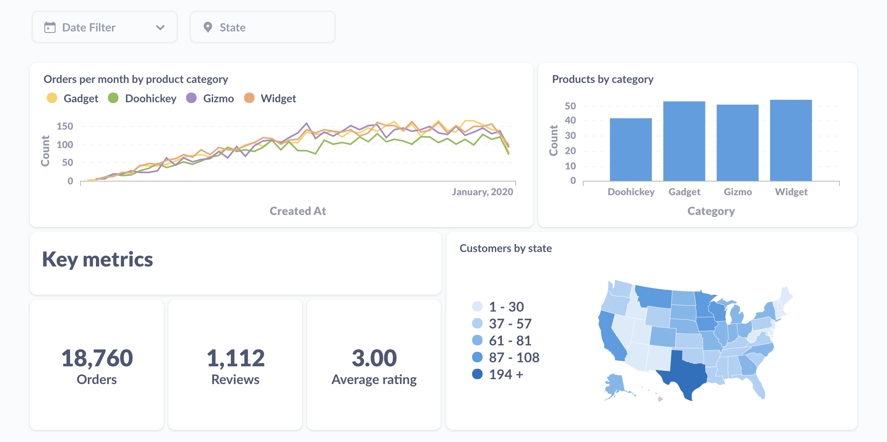

Khi làm ra một hệ thống, hoặc một ứng dụng. Ngoài vấn đề về vận hành, thì báo cáo (report) cũng là một phần rất quan trọng không thể thiếu của các ứng dụng. Dựa vào báo cáo, các cấp quản lý có thể biết tình hình kinh doanh hiện tại của công ty, cũng như phát hiện ra các vấn đề và kịp thời đưa ra giải pháp để đảm bảo lợi nhuận cho công ty.

<!-- truncate -->

Một báo cáo có thể có nhiều loại khác nhau như: bảng biểu, bản đồ, chart, ... Để phát triển các báo cáo như vậy đòi hỏi bạn phải tốn nhiều thời gian để phát triển (cả phía Backend và Frontend), dẫn đến tốn nhiều công sức, và có thể gây ra chậm trễ đối với tình hình kinh doanh.

Apache Superset sinh ra để đảm nhiệm việc làm report này tốn ít công sức hơn, nhưng vẫn mang lại hiểu quả tối đa. Nào, bây giờ chúng ta cùng bắt đầu khám phá nhé 

## 1. Apache Superset là gì?

Apache Superset là một phần mềm mã nguồn mỡ được phát triển bởi AirBnB, được thiết kế dùng để trực quan hoá dữ liệu một cách sinh động, làm báo cáo một cách hiệu quả.

Superset cung cấp một giao diện người dùng trực quan, dễ sử dụng, thân thiện với người dùng. Cho phép người dùng tạo ra các biểu đồ, bản đồ từ nhiều nguồn dữ liệu đa dạng khác nhau

## 2. Ưu và nhược điểm của Apache Superset

### a. Ưu điểm

* Mã nguồn mở: nghĩa là bạn có thể sử dụng miễn phí, và có cộng đồng người dùng luôn đóng góp và cải thiện chất lượng của sản phẩm

* Dễ sử dụng: giao diện thân thiện với người dùng, bạn không cần là một chuyên gia về dữ liệu để có thể sử dụng và vẫn tạo ra những Dashboard, bản đồ đẹp mắt

* Đa dạng các loại bản đồ, biểu đồ: Superset cung cấp sẵn cho bạn một lượng lớn các loại bản đồ, biểu đồ miễn phí. Tuy nhiên, bạn hoàn toàn có thể thêm vào các biểu đồ khác

* Hỗ trợ nhiều nguồn dữ liệu đa dạng: Superset hiện tại đã hỗ trợ tất cả các loại cơ sở dữ liệu phổ biến nhất hiện nay như Postgres, MySQL, ... Ngoài ra, đối với các cơ sở dữ liệu chưa được hỗ trợ (Như MongoDB), bạn hoàn toàn có thể kết nối thông qua các công cụ truy vấn phân tán như Trino, Presto, ...

### b. Nhược điểm

Bên cạnh những ưu điểm mà chúng tôi đã đề cập ở trên, thì Superset cũng có những nhược điểm sau:

* Cài đặt và cấu hình phức tạp: đối với người bắt đầu, hoặc người không làm thiên về lĩnh vực IT, thì việc cài đặt và cấu hình Superset sẽ rất khó khăn. 

* Hạn chế tuỳ chỉnh giao diện: Superset khá hạn chế vế mặt tuỳ chỉnh giao diện, bạn chỉ có thể thay đổi những giao diện đơn giản thông qua cấu hình được cung cấp hoặc phần CSS được nhúng vào từng Dashboard

* Thiếu hỗ trợ chính thức: Vì là mã nguồn mở, Superset không có nhà hỗ trợ chính thức, mà người dùng sẽ dựa vào những cách giải quyết nếu gặp phải từ cộng đồng

## 3. So sánh Apache Superset với các phần mềm khác

Các phần mềm tương tự với Apache Superset ta có thể đề cập như sau:

### a. Tableau

Được xem là công cụ mạnh nhất trong ngành phân tích dữ liệu

Là phần mềm thương mại, có bản quyền, và không có bản miễn phí

Giao diện được đánh giá là dễ sử dụng, trực quan, và không cần một người có quá nhiều kinh nghiệm lập trình vẫn có thể làm ra được các loại biểu đồ, report

Có hiệu suất tốt

### b. PowerBI

Có bản miễn phí nhưng chỉ dừng lại ở chức năng cơ bản. Phiên bản trả phí có nhiều tính năng cao cấp hơn

Tích hợp tốt với hệ sinh thái của Microsoft

Có khả năng phân tích nâng cao, hỗ trợ tính toán tốt qua ngôn ngữ Dart, và có khả năng tích hợp mô hình máy học Azure ML

Dễ sử dụng và triển khai

### c. Metabase

Tương tự như Superset, đây là một phần mềm mã nguồn mở và miễn phí

Dễ sử dụng hơn Superset, người dùng không cần phải biết SQL để tạo ra các biểu đồ và báo cáo

Dù dễ sử dụng, nhưng Metabase có ít tính năng hơn Superset, và không phù hợp với các yêu cầu tính toán quá phức tạp

Từ bài viết sau, chúng ta sẽ tìm hiểu cách cài đặt Superset như thế nào nhé.