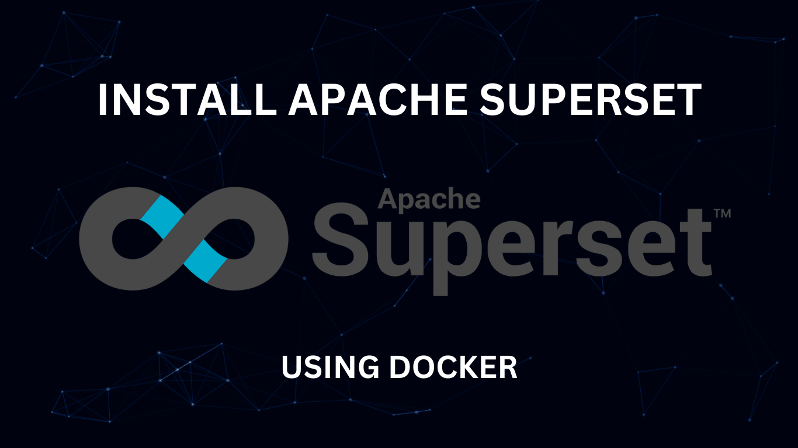
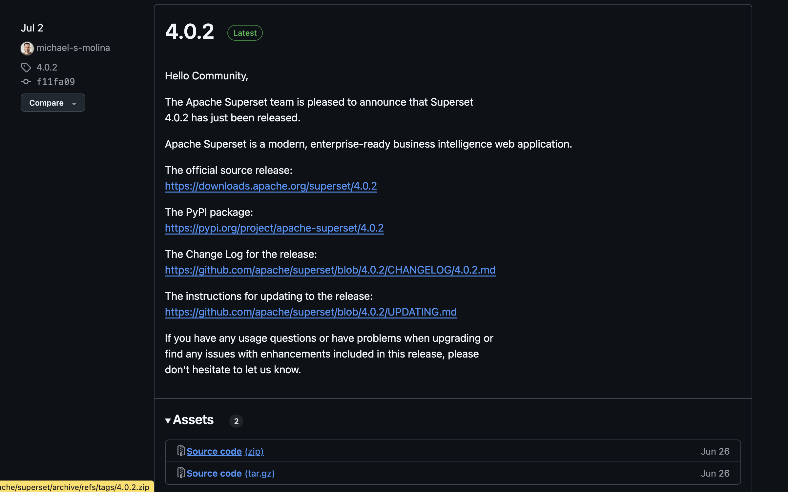
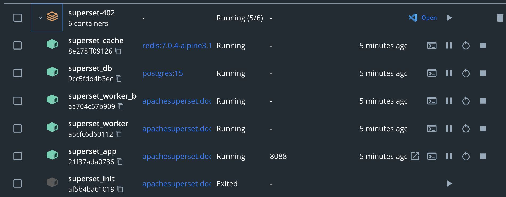
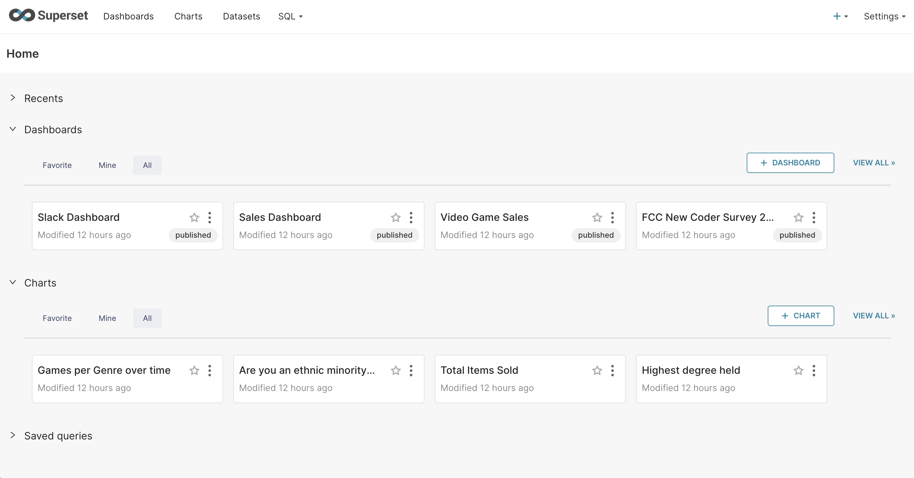

Hôm nay, chúng mình sẽ hướng dẫn các bạn cách cài đặt Superset trên máy tính cá nhân, để có thể thoả thích nghiên cứu nhé

<!-- truncate -->

## 1. Chuẩn bị

Đầu tiên, để có thể cài Superset, chúng ta cần download và cài đặt Docker tại: https://www.docker.com/. Đây là một nền tảng mã nguồn mở dùng để triển khai, quản lý và vận hành các ựng dụng trong container. 

Khi chúng ta chạy Superset trên Docker, nó sẽ chạy độc lập mà không cần phải cài đặt các phần mềm khác trên máy tính cá nhân của bạn như Python, Postgres, Redis, Node ...



## 2. Cách cài đặt chi tiết Apache Superset

### Bước 1: Download mã nguồn của Apache Superset

Bạn có 2 cách để download mã nguồn của Superset:
- Cách 1: Dùng git, chạy lệnh `git clone --depth=1  https://github.com/apache/superset.git`, bạn sẽ lấy về bản mới nhất của Superset
- Cách 2: Download trực tiếp mã nguồn từ Github
  * Vào website mã nguồn của Superset: https://github.com/apache/superset/releases
  * Chọn version mà bạn muốn tải, như trong hình mình lựa chọn phiên bản mới nhất là 4.0.2
  * Bạn có thể tải theo định dạng zip hoặc tar.gz. Sau đó, giải nén ra



### Bước 2: Chạy ứng dụng

Sau khi giải nén, chúng ta sẽ thấy trong thư mục của Superset đã có file docker-compose. Có 2 file docker-compose:
- `docker-compose.yml`: phiên bản dùng cho môi trường phát triển (development). Bạn có thể thay đổi mã nguồn của Superset, sau đó chạy bằng lệnh docker-compose
- `docker-compose-non-dev.yml`: dùng cho môi trường production

Cách chạy đơn giản là chúng ta sẽ start app bằng docker-compose

```shell
docker-compose -f docker-compose-non-dev.yml up -d
```


## 3. Các thành phần trong gói cài đặt

Sau khi cài đặt, bạn sẽ thấy trên màn hình Docker Dashboard, sẽ có những thành phần sau:



- superset_app: đây là thành phần chính của Superset, bao gồm cả Backend và Fronend
- superser_cache: dùng để cache thông tin trên Apache Superset, giúp tăng tốc độ khi truy cập vào xem các report. Cache dùng Redis
- superser_db: dùng để lưu trữ các thông tin cần thiết (Metadata) của Superset như: Dashboard, Chart, phân quyền user, ... DB này đang dùng Postgres
- superset_worker: dùng để chạy các tác vụ như async query, hoặc snapshot lại các report, gửi email 
- superset_worker_beat: thực hiện thêm scheduler và tương tác với worker để làm tác vụ nào đó. Các thành phần này đang dùng Celery

## 4. Vào trang web Superset

Sau khi các thành phần của Superset đã chạy hoàn tất, bạn truy cập vào http://localhost:8088 để mở Superset lên, đăng nhập bằng account mặc định của Superset:
- Username: admin
- Password: admin


Như vậy là bạn đã hoàn thành xong việc cài đặt Superset rồi nhé

