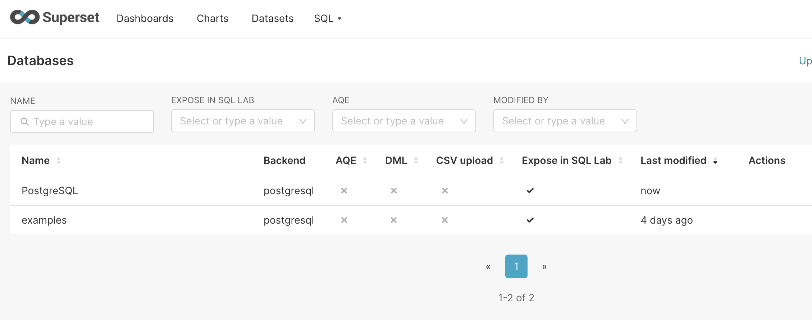

Ở bài trước, mình đã [hướng dẫn các bạn cách cài đặt Apache Superset](/2024-10-01-cai-dat-superset). Sau khi đã cài đặt xong, thì điều đầu tiên chúng ta muốn nghĩ tới đó là làm sao có thể làm một dashboard, report bằng Superset được. Trong bài viết này, mình sẽ hướng dẫn các bạn từng bước để có thể làm được một report nhé, có hình ảnh minh hoạ

<!-- truncate -->

## 1. Tóm tắt quá trình

Để có thể làm được một Dashboard bằng Superset, thì điều kiện tiên quyết là bạn cần phải có nguồn dữ liệu, nghĩa là bạn sẽ lấy dữ liệu từ đâu để làm report. Như trong bài [giới thiệu về Superset](/2024-09-30-tim-hieu-ve-apache-superset) mình có chia sẻ, hiện tại Superset có thể hỗ trợ từ rất nhiều nguồn dữ liệu khác nhau như Postgres, MySQL, Clickhouse, Microsoft SQL Server, ...

Sau khi đã xác định được nguồn dữ liệu, thì các bạn cần phải kết nối Superset với nguồn dữ liệu của mình 

Tiếp theo, từ nguồn dữ liệu đó, cần phải tạo các Dataset trên Superset. Các report trên Superset không làm việc trực tiếp với nguồn dữ liệu của bạn, mà sẽ làm việc thông qua các Dataset

Từ các Dataset đó, chúng ta có thể tạo ra các biểu đồ (Chart). Việc sắp xếp 1 hoặc nhiều biểu đồ lại với nhau trên một màn hình, màn hình đó gọi là Dashboard

Nào, bây giờ chúng ta sẽ bắt đầu đi qua từng bước nhé

## 2. Kết nối Superset đến Datasource

Như phần 1 mình đã đề cập đến, điều đầu tiên chúng ta cần đó là kết nối tới nguồn dữ liệu chúng ta muốn để làm report. Để kết nối được với nguồn dữ liệu, chúng ta làm tuần tự từng bước như sau:

Bước 1: Bạn dùng account có quyền Admin, nhấn vào menu Settings ở góc phải trên của màn hình -> chọn Database Connections

Bước 2: Chọn loại Database theo nguồn database của bạn. Ví dụ ở đây, mình sẽ chọn Postgres

Bước 3: Điền đẩy đủ các thông tin cần thiết như host, port, DB name, user, password để kết nối tới Database cần lấy dữ liệu làm report của bạn

Bước 4: Sau khi connect thành công, thì sẽ chuyển qua màn hình config cuối cùng, ở đây mình quan tâm nhiều nhất là mục SQL Lab. Ở đây, bạn có thể cấp thêm quyền để có thễ tương tác với DB của mình thông qua SQl Lab

Sau khi kết nối Database thành công, bạn sẽ thấy DB của mình nằm trong danh sách

Như vậy, việc kết nối Datasource thành công.