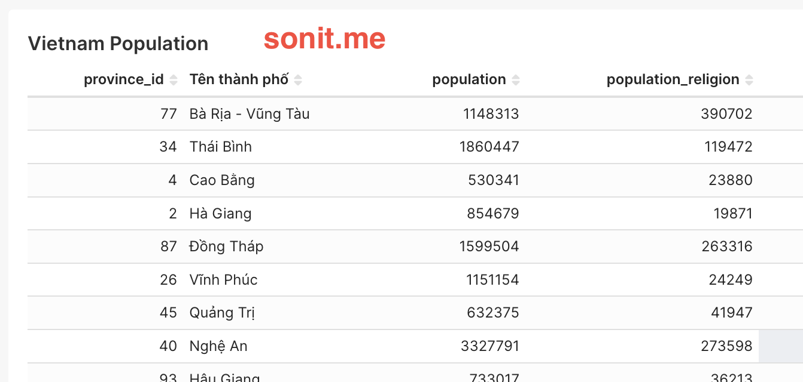
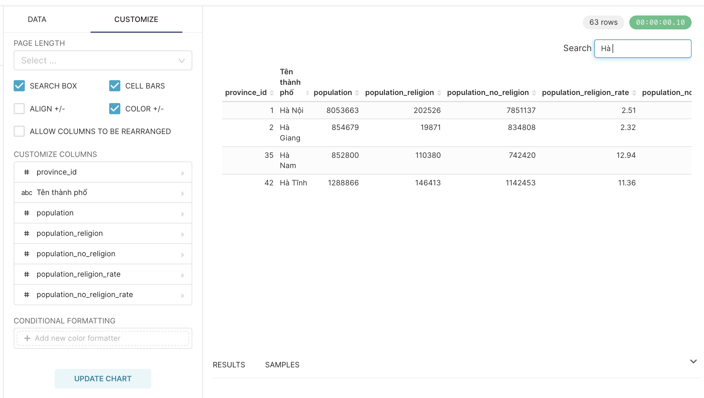

Biểu đồ dạng bảng (Table) là một trong những dạng biểu đồ phổ biến nhất và đơn giản nhất khi làm report. Mục đích của các biểu đồ này là giúp cho người xem quan sát được con số cụ thể của từng tiêu chí như thế nào? Có thể xem theo dạng sắp xếp theo một thứ tự nào đó, hoặc đơn giản nhất là liệt kê theo từng cột trong Dataset của mình. 

<!-- truncate -->

## 1. Các loại biểu đồ dạng bảng (Table Chart)

Khi bạn vào menu Charts của Superset, chọn loại chart là Table, bạn sẽ thấy Superset đã có sẵn 3 loại cho chúng ta lựa chọn, đó là: Table, Pivot Table, Time-series Table. Tuỳ vào từng nhu cầu cụ thể của bài toán đưa ra, bạn sẽ chọn loại biểu đồ sao cho phù hợp nhé. 

Dưới đây, mình sẽ hướng dẫn chi tiết theo từng loại nhé

## 2. Tạo biểu đồ bảng (Table)

### a. Giới thiệu

Biểu đồ dạng bảng (Table) là biểu đồ đơn giản, thể hiện theo hàng ngang và hàng cột giống với Excel

Mục đích: dùng để hiển thị chi tiết dữ liệu của mình, chẳng hạn như danh sách giao dịch, danh sách đơn hàng, danh sách nhân viên, danh sách học sinh, ... Loại biểu đồ này bạn có thể thấy ở nhiều nơi, bất cứ chỗ nào có dữ liệu thì bạn đều có thể bắt gặp loại biểu đồ này.

### b. Cách tạo biểu đồ bảng

Quy trình tạo một biểu đồ như thế nào, mình đã giới thiệu ở bài [Cách làm report đơn giản bằng Superset](/2024-10-09-cach-lam-report-don-gian-bang-apache-superset-phan-2). Để tạo biểu đồ bảng rất đơn giản, bạn chỉ cần việc chọn cột nào cần hiển thị trên biểu đồ của bạn, sau đó nhấn Update Chart, thì bạn có thể nhìn thấy thành quả của mình ở bên phía tay phải

## 3. Tạo biểu đồ Pivot (Pivot Table)

### a. Giới thiệu

Pivot Table là một dạng biểu đồ nhóm lại các tiêu chí giống nhau, và có thể tính toán các con số dựa vào tiêu chí đó.

Mục đích: giúp xem thống kê nhanh theo tiêu chí mà người xem mong muốn. 

VD: như hình trên, mình mong muốn nhóm lại những tỉnh nào có dân số > 5 triệu người, và những thành phố nào < 5 triệu người 

### b. Cách tạo biểu đồ bảng

Bước 1: Bạn cần phải chọn loại Chart là Pivot Table

Bước 2: Pivot Table bắt buộc bạn phải có 2 phần: 
* 1. Dimension (tức bạn muốn nhóm lại theo tiêu chí nào), có 2 dạng là Row (xem theo dòng) và Column (xem theo cột) 
* 2. Metric (bạn muốn dùng phép tính gì cho Dimension của bạn), ví dụ như Sum, Average, Min, Max, ...

## 4. Tạo biểu đồ Time Series (Time-series Table)

### a. Giới thiệu

Time-series table là một dạng chart dùng để xem xu hướng của data theo thời gian. VD trong 1 tuần, mình muốn xem kết quả kinh doanh của mình theo từng ngày là tăng hay giảm, thì có thể dùng biểu đồ này

Biểu đồ này giúp người dùng có thể xem xu hướng 

:::warning

Lưu ý: để có thể xây dựng một biểu đồ Time-Series, trong dataset của bạn bắt buộc phải có 1 column để xác định thời gian mà chúng ta cần xem xu hướng. VD: ngày tạo, ngày cập nhật, ...

:::

### b. Cách tạo biểu đồ Time-Series

Bước 1: Bạn cần phải chọn loại Chart là Time-series Table, và chọn Dataset cần để làm report

Bước 2: Trên Time-series Table sẽ có một vài thuộc tính sau:
- Time Column: chọn column có kiểu dữ liệu timestamp trong Dataset
- Time Grain: chọn mức thời gian muốn xem xu hướng (theo ngày, theo tuần, theo tháng ...)
- Metrics: chọn cách dữ liệu bạn muốn xem 
- Time series columns: chọn kiểu bạn muốn xem (số, line, ...)

## 5. Một số thủ thuật khi làm việc với biểu đồ dạng bảng

### a. Cách đổi tên cột

Thông thường, Superset sẽ lấy tên column trong Dataset để làm tên column của report. Điều này sẽ không thân thiện với người dùng, mà có nhiều khả năng sẽ gây khó hiểu cho người dùng.

Để đổi tên cột, bạn làm theo từng bước sau:
- Bước 1: Nhấn vào cột bạn muốn đổi tên
- Bước 2: Chọn tab `CUSTOM SQL`
- Bước 3: Nhấn vào cây bút trên header
- Bước 4: Đổi tên lại theo như mong muốn
- Bước 5: nhấn Save

### b. Lọc data hiển thị

- Phần lọc data này hầu hết đều có trên tất cả các chart
- Mục đích dùng để lọc bớt data muốn hiển thị trên chart. VD: bạn có 1 dataset có tất cả các tỉnh thành của Việt Nam. Nếu bạn muốn làm một chart chỉ hiển thị data của miền Nam, thì đây là lựa chọn hiệu quả
- Bạn có thể dùng theo cách đơn giản là chọn column và điều kiện cần hiển thị. Hoặc bạn có thể viết câu query ở tab `CUSTOM SQL` để cho ra những bộ lọc có độ phức tạp cao hơn, hoặc là kết hợp nhiều điều kiện với nhau

### c. Sắp xếp dữ liệu theo điều kiện

- Bạn chọn cột cần sắp xếp của thuộc tính `SORT BY`
- Phía dưới, bạn sẽ thấy check box `SORT DESCENDING`. Nếu check và checkbox này, thì data của bạn sẽ được sắp xếp từ cao xuống thấp, ngược lại là từ thấp lên cao

### d. Thêm ô tìm kiếm dữ liệu

- Áp dụng cho chart Table gốc (theo hàng và cột)
- Dùng để tìm kiến từ khoá có trong table
- Nhấn qua tab `CUSTOMIZE`, tick vào ô `SEARCH BOX`. Như vậy là chúng ta có thể tìm kiếm dữ liệu trong Table được

### e. Phân trang

- Cũng áp dụng cho table gốc
- Việc phân trang này cần thiết khi mà lượng dữ liệu của bạn cần hiển thị có rất nhiều dòng
- Nhấn qua tab `CUSTOMIZE`, ngay phần `PAGE LENGTH`, bạn chọn số lượng dòng muốn hiển thị trong 1 trang, thì Superset sẽ tự động hiển thị số trang

- Tuy nhiên, đây chỉ là cách trên Frontend và hoàn toàn không tối ưu performance nếu như bạn có nhiều dòng dữ liệu. Vì vậy, Superset cho bạn phân trang từ Backend (Server) bằng cách bạn tick chọn vào checkbox `SERVER PAGINATION`

### f. Định dạng lại chữ, số

- Mặc định, Superset sẽ hiển thị ra tất cả các số, hoặc định dạng số, ngày tháng năm theo format mặc định. Chúng ta có thể đổi lại format như mong muốn
- Nhấn vào `CUSTOMIZE`, chọn vào column bạn muốn thay đổi format -> một popup hiện ra, chọn tab `NUMBER FORMATTING`
- Superset đang sử dụng D3 Format (https://github.com/d3/d3-format). Nếu những định dạng nào Superset không có trong danh sách, bạn hoàn toàn có thể gõ trực tiếp định dang theo D3

- Để format ngày, tháng, năm thì bạn chọn format hiển thị như mong muốn trong thuộc tính `TIMESTAMP FORMAT`

