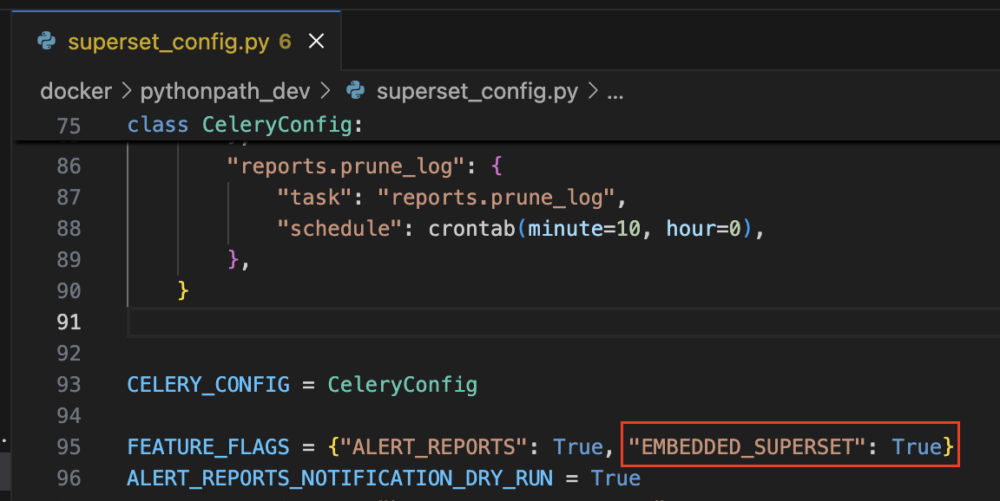
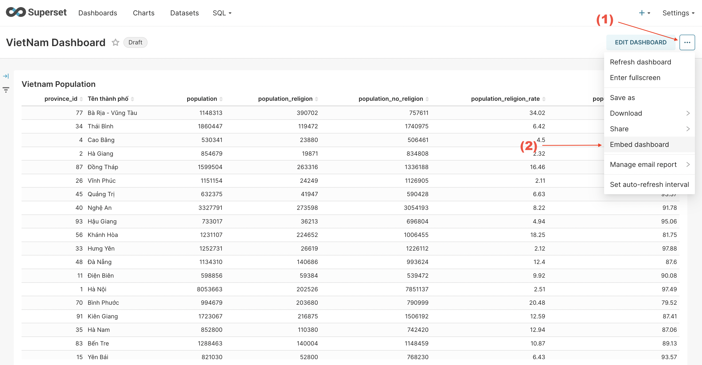
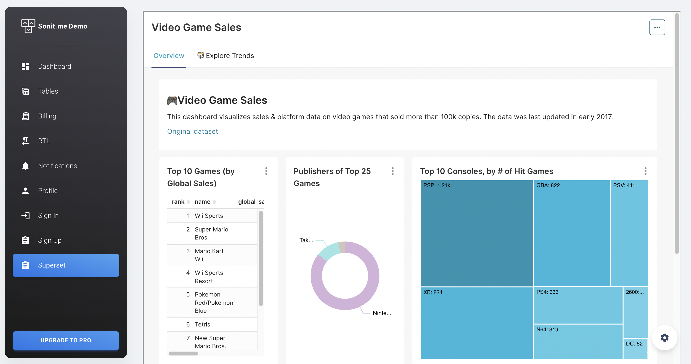

Một điểm hay của Apache Superset là bạn có thể nhúng dashboard sau khi đã hoàn thành xong vào bất kỳ trang web nào của bạn. Đây thật sự là một điều tốt vì chúng ta có thể làm các báo cáo một cách nhanh chóng mà không phải mất quá nhiều thời gian và resource để xây dựng Backend, Frontend. 

Để có thể nhúng được Superset vào website của mình, chúng ta cần phải tích hợp cả Backend và Frontend của bạng với Superset. Bây giờ hãy bắt đầu tìm hiểu cách nhúng một dashboard của Apache Superset vào website của mình như thế nào nhé.

## 1. Cách lấy UUID của 1 Dashboard trên Superset

### a. Cài đặt biến môi trường

- Đầu tiên, để có thể mở chức năng cho phép nhúng một Dashboard của Superset vào bất kỳ trang web nào, chúng ta cần setup biến môi trường của Superset

- Nếu bạn deploy bằng Docker, bạn hãy mở file `docker/pythonpath_dev/superset_config.py`, tìm đến dòng `FEATURE_FLAGS`, và thêm biến `EMBEDDED_SUPERSET` vào config với giá trị là True



Các bạn nhớ, sau khi config xong thì cần phải restart lại container của mình thì mới nhận được biến môi trường nhé

### b. Cách lấy UUID

Mỗi Dashboard đều có 1 key riêng, format theo định dạng của UUID. Để nhúng được vào website, thì Superset cần phải biết bạn muống nhúng Dashboard nào, vì vậy cần phải lấy UUID của dashboard bạn mong muốn nhúng

Sau khi đã mở config `EMBEDDED_SUPERSET=True`, bạn làm các bước sau để lấy UUID nhé:
- Bước 1: mở dashboard mà bạn muốn nhúng
- Bước 2: Nhấn vào nút ba chấm ở góc trên bên phải, sau đó chọn `Embed dashboard`



- Bước 3: Một popup nhỏ hiện lên, nhấn nút `ENABLE EMBEDDING`


- Bước 4: bạn sẽ thấy UUID của dashboard này, đây là key của dashboard phục vụ cho việc tích hợp vào website. Bạn cần note lại key này để làm các bước tiếp theo nhé


## 2. Backend

### a. Nhiệm vụ

- Tích hợp trực tiếp với API của Apache Superset, bao gồm: xác thực (Authorization), phân quyền, lấy Guest Token để cung cấp cho FE nhúng vào Superset

- Tích hợp với Superset phía Backend sẽ đảm bảo tính bảo mật, tránh lộ những thông tin nhạy cảm như username, password

### b. Các bước tích hợp với Apache Superset

**Bước 1: Gọi API login để lấy access token**

```shell
curl --location '{{superset_domain}}/api/v1/security/login' \
--header 'Content-Type: application/json' \
--data '{
  "password": "{{user_login}}",
  "provider": "db",
  "refresh": false,
  "username": "{{password_login}}"
}'
```

:::warning
- user_login / password_login: account login vào Superset. Account này phải có quyền **can grant guest token on SecurityRestApi**

- superset_domain: domain của website superset
:::

**Bước 2: Gọi API để lấy csrf token**

```shell
curl --location '{{superset_domain}}/api/v1/security/csrf_token/' \
--header 'Authorization: Bearer {{access_token}}'
```

:::warning
- access_token: được lấy từ kết quả trả ra của API login ở bước 1
:::

**Bước 3: Gọi API lấy guest token**

```shell
curl --location '{{superset_domain}}/api/v1/security/guest_token/' \
--header 'X-Csrftoken: {{csrf_token}}' \
--header 'Authorization: Bearer {{access_token}}' \
--header 'Content-Type: application/json' \
--data '{
    "resources": [
        {
            "id": "{{dashboard_uuid}}",
            "type": "dashboard"
        }
    ],
    "user": {
        "username": "{{user_login}}"
    },
    "rls": [{
        "clause": "team_id IN (1)"
    }]
}'
```

:::warning
- access_token: được lấy từ kết quả trả ra của API login ở bước 1
- csrf_token: được lấy từ kết quả trả ra của API login ở bước 2
- dashboard_uuid: uuid của dashboard được lấy từ phần [1]
:::

:::warning
rls (Row Level Security): thường dùng để phân quyền data theo level row trong Dataset. Như ví dụ trên, thì mình chỉ lấy dữ liệu của team có ID = 1
:::

## 3. Frontend

### a. Nhiệm vụ

- Sau khi đã lấy được guest token phía Backend, thì tiếp theo chúng ta cần làm sao để có thể hiển thị dashboard của Superset trên website. 

- Apache Superset cung cấp cho chúng ta một thư viện SDK cho React JS, để có thễ dễ dàng đưa dashboard của mình vào website

### b. Các bước thực hiện 

**Bước 1: Cài đặt Superset Embed SDK**

```shell
npm install --save @superset-ui/embedded-sdk
```

**Bước 2: Nhúng SDK vào website muốn hiển thị Dashboard**

```js
import { useEffect } from "react";

import DashboardLayout from "examples/LayoutContainers/DashboardLayout";

// Import Superset SDK
import { embedDashboard } from "@superset-ui/embedded-sdk";

// Function này gọi API tới Backend để lấy Guest Token
const getToken = async () => 'eyJ0e...';

function Superset() {
    useEffect(() => {
        const embed = async () => {
            embedDashboard({
                id: "{{dashboard_uuid}}", 
                supersetDomain: "{{superset_domain}}",
                mountPoint: document.getElementById("superset_dashboard"), 
                fetchGuestToken: () => getToken(),
                iframeSandboxExtras: ['allow-top-navigation', 'allow-popups-to-escape-sandbox']
            });

            const iframe = document.getElementById('superset_dashboard')?.querySelector('iframe')

            if (iframe) {
                iframe.style.width = '100%'
                iframe.style.height = '800px'
            }
        }

        if (document.getElementById('superset_dashboard')) {
            embed()
        }
    }, [])

    return (
        <DashboardLayout>
            <div id="superset_dashboard" />
        </DashboardLayout>
    )
}

export default Superset;
```

Cuối cùng, chúng ta cùng xem kết quả nhé



