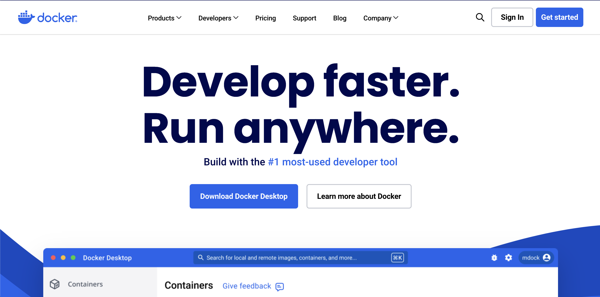
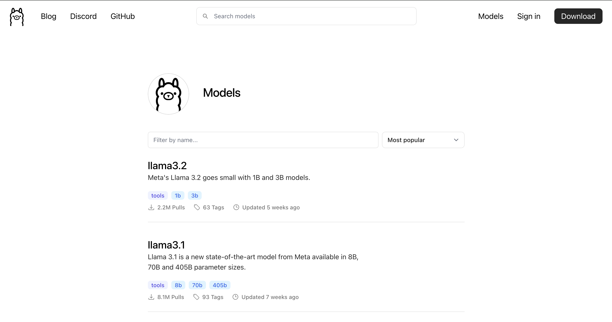

Ngày nay, chúng ta khá dễ dàng tiếp cận với các ứng dụng chat AI, nổi tiếng nhất phải kể đến là ChatGPT của OpenAI, Gemini của Google, Copilot của Microsoft, ... Các phần mềm này đối với một người dùng thông thường thì hầu như là xài miễn phí, trừ những trường hợp các bạn muốn sử dụng các tính năng nâng cao hơn thì cần phải trả tiền để nâng cấp.

Tuy nhiên, nếu bạn muốn thử tự mình dựng lên một trợ lý riêng cho mình trên máy tính cá nhân, và muốn tự do lựa chọn model, thì hãy xem bài viết dưới đây, mình sẽ hướng dẫn chi tiết nhé

<!-- truncate -->

## 1. Giới thiệu


Trước đây, việc cài đặt một mô hình AI nói chung và LLM nói riêng trên máy tính cá nhân có thể nói là một điều rất khó khăn. Chúng đòi hỏi yêu cầu cấu hình máy tính rất cao, và trải qua quá trình cài đặt rất là phức tạp. Nếu máy tính của bạn chỉ sử dụng CPU mà không có card màn hình gắn rời thì đó là một điều hết sức khó khăn

Tuy nhiên, trong những năm gần đây, với sự ra đời của nhiều mô hình ngôn ngữ lớn ra đời (LLM), mà đi đầu là ChatGPT, đã mang đến cho mọi người cơ hội gần hơn được tiếp xúc với AI, kể cả những người bình thường hoặc đang làm việc trong các lĩnh vực khác, không liên quan đến các ngành Khoa học máy tính vẫn có thể sử dụng được AI. Tiếp theo, với mong muốn làm chủ công nghệ của mình, cộng đồng lập trình viên cũng như các tổ chức lớn đã cho ra đời nhiều mô hình ngôn ngữ lớn mã nguồn mỡ (Open Source), chẳng hạn như Gamma của Google (đây có thể được coi là 1 phần của Gemini), Llama của Meta, và còn hàng tá mô hình mã nguồn mở khác, từ đó có thể giúp cho mọi người có thể tự tay xây dựng 1 hệ thống LLM, hay gọi đơn giản hơn là 1 hệ thống Chatbot của riêng mình.


Trong bài viết hôm nay, SonIT.me sẽ hướng dẫn các bạn cách dựng hệ thống LLM trên máy tính cá nhân với [Olama](https://ollama.com/). Olama là một công cụ dùng để quản lý và chạy các model AI một cách dễ dàng trên máy tính cá nhân, và có thể deploy lên server vật lý.

## 2. Cài đặt Docker

Có nhiều cách cài đặt Ollama trên máy tính của bạn, nhưng cách đơn giản nhất là bạn cài trên [Docker](https://www.docker.com/).



Trong đây, mình không hướng dẫn chi tiết cách cài đặt Docker, bạn có thể tham khảo cách cài đặt tại đây dựa vào hệ điều hành mà bạn đang sử dụng nhé

https://docs.docker.com/desktop/install/mac-install/

## 3. Cài đặt Ollama

Sau khi đã cài đặt Docker, việc tiếp theo là chúng ta cần tìm Docker Image của Ollama trên Docker Registry Official. 

Bạn vào trang chính thức của Ollama trên Docker Hub ([Nhấn tại đây](https://hub.docker.com/r/ollama/ollama/tags), tìm version mới nhất. Tại thời điểm viết bài, thì version mới nhất của Ollama là 0.3.14


Tiếp theo, bạn dùng lệnh sau để download docker image về và chạy nhé. Lệnh này chạy nếu bạn chỉ dùng CPU để xử lý

```shell
docker run -d -v ~/ollama:/root/.ollama -p 11434:11434 --name ollama ollama/ollama:0.3.14
```

Còn nếu máy tính bạn có card đồ hoạ gắn ngoài Nvidia GPU, thì chúng ta chạy lệnh sau để tận dụng sức mạnh của card đồ hoạ nhé

```shell
docker run -d --gpus=all -v ~/ollama:/root/.ollama -p 11434:11434 --name ollama ollama/ollama:0.3.14
```

:::warning
- Bạn cần phải mount folder `/root/.ollama` và ngoài, vì các model sẽ được download về và lưu vào thự mục đó. Nêu bạn không mount folder này, thì mỗi lần chạy lại lệnh docker run, thì bạn phải download model về lại. Việc này khá tốn thời gian vì dung lượng của LLM model là rất lớn, có thể từ vài GB đến vài chục GB
- Port 11434 là port để ứng dụng có thể giao tiếp với Ollame qua Rest API
:::

## 4. Cài đặt model trên Ollama

Ollama thực chất là một công cụ hỗ trợ để chạy model LLM, sau khi đã hoàn thành việc cài đặt ở bước trên, thì chúng ta vẫn chưa sử dụng được như một chat bot bình thường, mà cần phải cài thêm model trên Ollama.

Đầu tiên, vào trang thư viện của Ollama (https://ollama.com/library) để tìm một model phù hợp với máy tính của bạn nhé.



Nhấn vào model phù hợp, bạn sẽ thấy hướng dẫn cài đặt của một model bất kỳ cùng với phiên bản của nó. Như hình dưới, mình chọn model llama3.2, bạn sẽ thấy cách cài đặt model này là `ollama run llama3.2`


Để cài đặt model, chúng ta cần phải access vào docker container để chạy, sau đó chạy lệnh như trên:

```shell
docker exec -it ollama /bin/sh
ollama run llama3.2
```

Sau khi cài xong, bạn sẽ thấy màn hình terminal hiển thị như sau

```shell
# ollama run llama3.2
>>> Send a message (/? for help)
```

Bây giờ, bạn hãy thử hỏi 1 câu xem BOT của bạn sẽ trả lời như thế nào nhé?


OK, vậy là đã cài thành công rồi nhé. Trong những bài viết tiếp theo, mình sẽ hướng dẫn bạn xây dựng các hệ thống, cũng như các ứng dụng xung quanh Ollama nhé