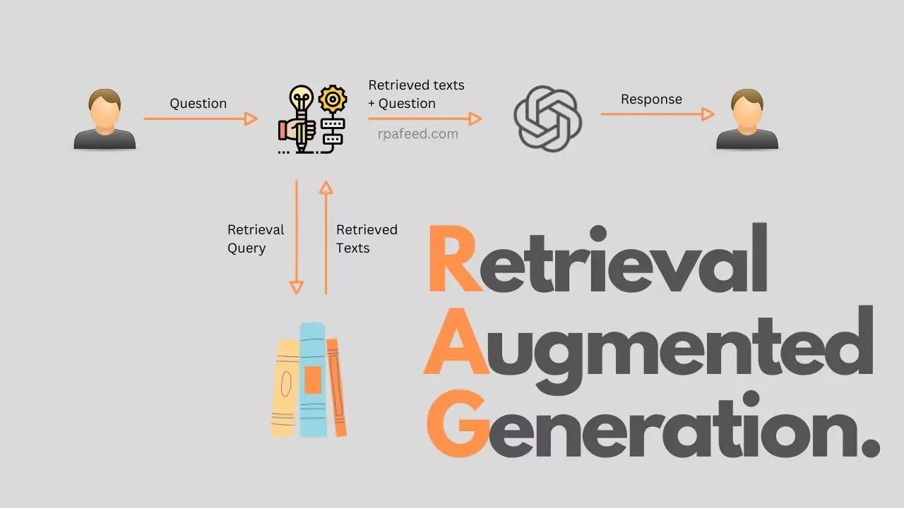

Ở bài trước, mình đã hướng dẫn các bạn [cách cài đặt Ollama trên máy tính cá nhân](/2024-11-01-how-to-install-large-language-model-locally), đồng thời hướng dẫn cách bạn cài một model trên Ollama như thế nào? Tiếp theo chuỗi bài viết liên quan đến Large Language Model và Ollama, hôm nay mình sẽ hướng dẫn các bạn cách xây dựng 1 RAG server đơn giản, tích hợp với Ollama như thế nào nhé.

<!-- truncate -->

## 1. RAG server là gì?

Retrieval-Augmented Generation (RAG), là một phương pháp trong xử lý ngôn ngữ tự nhiên (NLP) kết hợp giữa hai thành phần chính:
- Retrieval (Truy xuất): Trước tiên, hệ thống RAG sẽ tìm kiếm và truy xuất thông tin từ một tập dữ liệu lớn hoặc cơ sở tri thức. Điều này giúp nó lấy thông tin liên quan để trả lời câu hỏi hoặc cung cấp ngữ cảnh.
- Generation (Tạo sinh): Sau khi đã có thông tin truy xuất, hệ thống sẽ sử dụng một mô hình ngôn ngữ để tạo ra câu trả lời. Nó sẽ kết hợp thông tin truy xuất với khả năng tạo ngôn ngữ tự nhiên của mình để tạo ra câu trả lời hợp lý và phù hợp ngữ cảnh.

## 2. Lợi ích khi dùng RAG server

So với việc dùng một model bình thường, thì RAG server có các ưu điểm sau:

- Nâng cao độ chính xác: vì RAG dựa vào data của bạn, nên câu trả lời của RAG đưa ra có độ chính xác cao hơn
- Cập nhật dữ liệu nhanh chóng: thay vì cần huấn luyện lại mô hình để AI có thể hiểu được data của bạn (tốn nhiều chi phí về resource và thời gian), thì RAG sẽ truy xuất trực tiếp tới cơ sở dữ liệu của bạn, cập nhật dữ liệu mới nhanh chóng hơn
- Thông tin cung cấp cho khách hàng chính xác hơn: RAG sẽ dựa vào data của bạn để trả lời cho khách hàng, nen thông tin mà AI cung cấp cho khách hàng có độ chính xác cao hơn

## 3. Các ứng dụng của RAG

Với những ưu điểm trên của RAG, thì bạn có thể làm được:
- Chatbot: đây là điều đầu tiên chúng ta sẽ nghĩ tới, một chatbot tư vấn sản phẩm và chăm sóc cho khách hàng mọi lúc mọi nơi 
- Hỗ trợ tìm kiếm tốt hơn: do chỉ trích xuất trên data của chính bạn, nên việc tìm kiếm sẽ chính xác hơn 
- Những ứng dụng cần cập nhật dữ liệu liên tục: chẳng hạn như trong y tế, giáo dục, phân tích tài chính, thị trường. Data sẽ được cập nhật liên tục, nên ứng dụng cũng phải cập nhật nhanh để có thể đưa ra câu trả lời 1 cách chính xác nhất

## 4. Xây dựng RAG server đơn giản với Golang, Langchain và Ollama

Như mô hình trên, RAG server sẽ kết nối với đồng thời giữa LLM (dùng để xử lý ngôn ngữ tự nhiên), và Vector Database chứa dữ liệu của chính bạn. Trong bài viết này, mình sẽ hướng dẫn cơ bản việc lấy data đơn giản (chưa dùng Database) để các bạn hiểu được cách làm việc của RAG server như thế nào nhé

