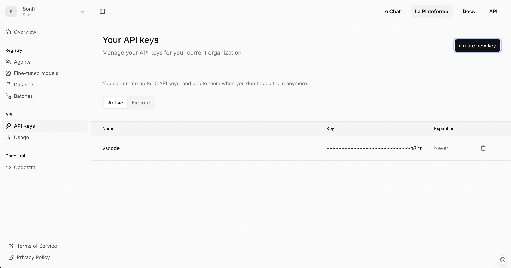
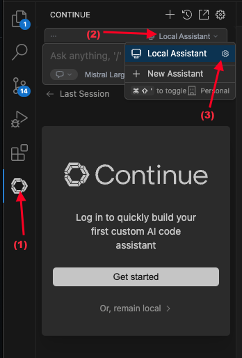
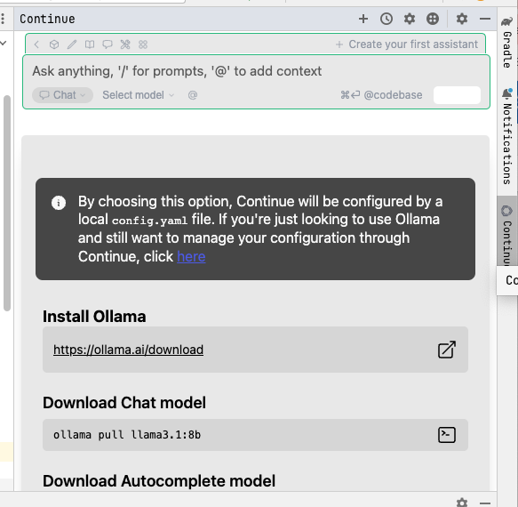
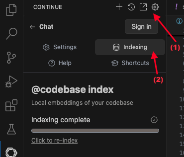
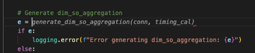

Ngày nay, việc sử dụng AI Assistant để hỗ trợ việc code đang làm cho việc làm của các dev trở nên dễ dàng và hiệu quả hơn. Tuy nhiên, các sản phẩm của Github Copilot, Tabnine, Cursor AI ... đều là các sản phẩm thu phí, và chi phí của các sản phẩm này cũng không thấp, đặc biệt là đối với các bạn sinh viên cũng như các bạn mới bắt đầu đi làm. Vì vậy, trong bài viết này, mình sẽ chia sẻ cách sử dụng AI Assistant miễn phí để hỗ trợ việc code cho các bạn nhé.

<!-- truncate -->

## 1. Giới thiệu về AI Assistant


AI Assistant trong các IDE là một công cụ tích hợp trí tuệ nhân tạo (AI) được thiết kế để hỗ trợ và nâng cao hiệu suất của nhà phát triển trong quá trình viết mã, gỡ lỗi, hiểu code và thực hiện các tác vụ liên quan đến phát triển phần mềm.

Ngày nay, có khá nhiều AI Assistant được phát triển trên thị trường, nổi tiếng nhất có thể kể đến Github Copilot, Cursor AI, Tabnine, ... nhưng các công cụ này đều có phí, hoặc là bản miễn phí xài rất là hạn chế

Hôm nay, mình sẽ hướng dẫn các bạn cách cài đặt và sử dụng AI Assistant miễn phí trên các IDE như VSCode, IntelliJ IDEA, ...

## 2. Các chức năng chính của AI Assistant


Các AI Assistant thường sẽ có những chức năng cơ bản sau:
- Tích hợp trực tiếp vào IDE: để AI Assistant có thể hiểu được code của bạn, project của bạn đang làm là gì, ... thì nó cần được tích hợp trực tiếp vào IDE, giúp bạn viết code nhanh hơn, hiệu quả hơn.
- Hoàn thành Code Thông minh: AI Assistant sẽ giúp bạn viết code nhanh hơn bằng cách tự động đề xuất các dòng code tiếp theo, hoặc đề xuất các hàm, biến, ... theo đúng ngữ cảnh dự án của bạn
- Gợi ý code: đề xuất cách viết code tốt hơn, các mẫu thiết kế phổ biến
- Phân tích code và phát hiện lỗi: Sử dụng các mô hình AI để phân tích code, phát hiện các lỗi tiềm ẩn, lỗ hổng bảo mật, các vấn đề về hiệu suất và đề xuất cách khắc phục.
- Trả lời câu hỏi liên quan đến Code: đặt các câu hỏi liên quan đến code trong dự án đang phát triển, nhận câu trả lời trực tiếp tron IDE.

## 3. Đăng ký tài khoản Mistral miễn phí

[Mistral AI](https://mistral.ai/) là một nền tảng cung cấp các sản phẩm liên quan đến trí tuệ nhân tạo, thuộc công ty Mistral có trụ sở tại Pháp. 

Mistral có một mô hình chuyên cho việc viết code, có tên là [Codestral](https://mistral.ai/news/codestral). đây là một mô hình tạo sinh được thiết kế và tối ưu hóa đặc biệt cho các tác vụ tạo code, gợi ý code và cải thiện code. Codestral được đào tạo trên hơn 80 ngôn ngữ lập trình, cho phép nó hoạt động tốt trên cả các ngôn ngữ phổ biến và ít phổ biến.

Hiện tại, bạn có thể sử dụng Codestral miễn phí trực tiếp trên nền tảng của Mistral. Bạn cần làm các bước sau:

- 1. Vào trang web https://console.mistral.ai/ và đăng ký tài khoản, hoặc bạn có thể sử dụng tài khoản mạng xã hội khác như Google, Microsoft, Apple để đăng nhập.

- 2. Sau khi đăng nhập thành công, bạn vào menu API Keys để tạo 1 API kếy nhé. Key này dùng để gọi API Mistral để hỏi đáp, trả lời trực tiếp trên IDE của bạn.



- 3. Tiếp theo, bạn vào menu Codestral để tạo 1 API key nhé. API key này dùng để tích hợp trực tiếp với IDE, để có thể tự động sinh code, gợi ý code cho bạn


Bạn nhớ lưu 2 key này lại để mình tiếp tục làm ở bước 4 nhé

## 4. Cách cài đặt extension AI Assistant (Continue)

Để tích hợp với API của Mistral, bạn cần cài đặt extension AI Assistant (Continue) trên VSCode và IntelliJ IDEA. https://www.continue.dev/. 

### a. Cài đặt Continue trên VSCode

Vào menu Extensions trên VSCode, tìm `Continue` và cài đặt


Sau khi cài đặt thành công, trên menu bên trái sẽ xuất hiện icon của Continue. Bạn nhấn vào icon đó, và làm theo tuần tự các bước theo hình dưới để mở file config.json



Trong file config.json, cần sửa lại những chỗ sau:

```json
"models": [{ // Config model cho chat với AI
    "title": "Mistral Large", // Đặt tên hiển thị của model
    "provider": "mistral", // Để mặc định là mistral
    "model": "mistral-large-latest", // model name, tìm hiểu thêm https://docs.mistral.ai/getting-started/models/models_overview/
    "apiKey": "xxx" // API key đã đăng ký ở bước 3.2
}],
"tabAutocompleteModel": { // Config model cho gợi ý code
    "title": "Codestral", // Đặt tên hiển thị của model
    "provider": "mistral", // Để mặc định là mistral
    "model": "codestral-latest", // model name cho gợi ý code, tên là codestral
    "apiKey": "xxx" // API key đã đăng ký ở bước 3.3
},
"embeddingsProvider": { // Config model cho tự động gợi ý khi gửi tin nhắn
    "provider": "mistral", // Để mặc định là mistral
    "model": "mistral-embed", // model name cho tự động gợi ý khi gửi tin nhắn, tên là mistral-embed
    "apiKey": "xxx", // API key đã đăng ký ở bước 3.2
    "apiBase": "https://api.mistral.ai/v1" // API link
}
```

Sau khi cài đặt xong, bạn save file lại, như vậy là xong

### b. Cài đặt Continue trên IntelliJ IDEA

Vào menu Settings -> Plugins -> Marketplace -> Tìm kiếm Continue -> Cài đặt


Sau khi cài đặt xong, menu Continue sẽ xuất hiện bên phía trái của IDE. Sau đó, bạn có thể config model giống như các bước cài đặt trên VSCode nhé



:::tip

Nếu bạn đang sử dụng cả VSCode và IntelliJ, thì bạn chỉ cần setup config ở một trong 2 IDE thôi nhé. Vì Continue sẽ đọc config của bạn ở thư mục `.continue` ở root folder của project. (`~/.continue/config.json`)

:::

## 5. Cách sử dụng

Để AI có thể hiểu được project của bạn cũng như hỗ trợ tốt hơn, bạn cần phải Index code của bạn nhé. Các bạn nhấn vào icon settings -> Indexing



Sau đó, trong quá trình bạn code, thì AI sẽ hộ trợ gợi ý code cho bạn rồi nhé



Ngoài ra, bạn cũng có thể chat trực tiếp để hỏi về code, cũng như hỗ trợ fix bug, tìm giải pháp, review code nhé


Như vậy là mình đã hoàn thành việc cài đặt và cấu hình một AI Assistant trên IDE của mình rồi. Ngoài Mistral, thì Continue hỗ trợ khá nhiều các provider khác như: Ollama, OpenAI, Claude, Gemini,... Bạn có thể tìm hiểu thêm để chọn một model phù hợp với yêu cầu và túi tiền của mình nhé