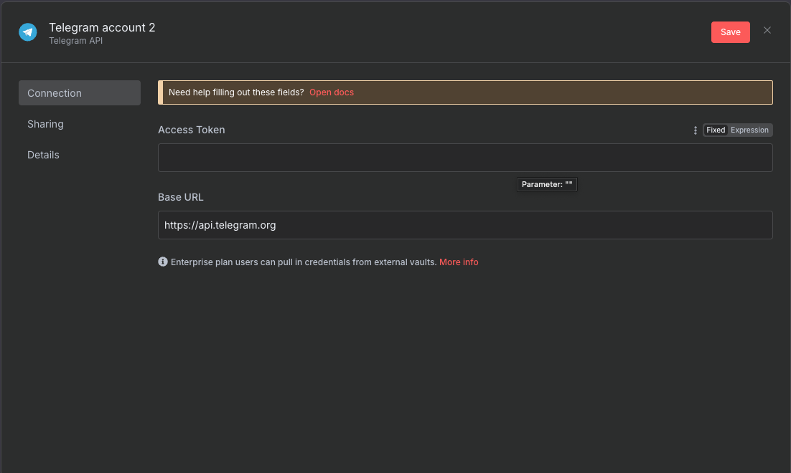

Trước đây, theo cách truyền thống, khi tích hợp một service mới với hệ thống của bạn, bạn sẽ cần phải viết code để tích hợp. Bạn sẽ cần check API document, viết code, test và deploy. Việc này mất khá nhiều thời gian và công sức.

Với sự phát triển của các hệ thống No code / low code, bạn có thể tích hợp một service mới với hệ thống của bạn bằng cách sử dụng giao diện người dùng, không cần phải viết code quá nhiều. Và n8n đã ra đời để giải quyết bài toán đó. Vậy n8n là gì? Nó có phải là một công cụ mạnh mẽ để bạn có thể tận dụng trong các hệ thống của mình hay không? Chúng ta hãy cùng bắt đầu tìm hiểu nhé.

<!-- truncate -->

## 1. N8n là gì?

N8n là một công cụ tự động hóa quy trình làm việc (workflow automation) mã nguồn mở, cho phép người dùng kết nối và tích hợp nhiều ứng dụng, dịch vụ và công cụ khác nhau để tạo ra các quy trình làm việc tự động hóa.

N8n được phát triển bằng Node.js và cung cấp một giao diện người dùng trực quan để thiết kế và quản lý các quy trình làm việc. Nó hỗ trợ nhiều loại kết nối, bao gồm HTTP, API, cơ sở dữ liệu, email, và nhiều hơn nữa.

N8n là một phần mềm mã nguồn mở, bạn có thể sử dụng bản trả phí (dùng trên Cloud) hoặc cài đặt trên máy của mình (Self-hosted).


## 2. Hướng dẫn cài đặt n8n

Có 2 cách cài đặt n8n phô biến, đó là cài đặt trực tiếp thông qua npm, và cài đặt thông qua Docker

### 2.1. Cài đặt n8n thông qua npm

- n8n yêu cầu máy của bạn phải cài đặt Node.js 18 hoặc version cao hơn.

- Sau đó, bạn mở terminal, gõ lệnh:

  ```sh
  npm install n8n -g
  ```

- Đề cài đặt một phiên bản cụ thể, bạn có thể sử dụng lệnh:

  ```sh
  npm install -g n8n@0.126.1
  ```

- Sau khi cài đặt xong, bạn có thể khởi động n8n bằng lệnh:

  ```sh
  n8n
  # or
  n8n start
  ```

### 2.2. Cài đặt n8n thông qua Docker

- Đầu tiên, bạn cần tạo 1 docker volumn để chứa data

  ```sh
  docker volume create n8n_data
  ```

- Tiếp theo, bạn sử dụng lệnh docker run để khởi động n8n

  ```sh
  docker run -it --rm --name n8n -p 5678:5678 -v n8n_data:/home/node/.n8n docker.n8n.io/n8nio/n8n
  ```

- Khi chạy lệnh trên, mặc định n8n sẽ sử dụng SQLite để lưu trữ dữ liệu. Nếu bạn muốn sử dụng PostgreSQL, bạn hãy chạy lệnh sau:

  ```sh
  docker run -it --rm \
  --name n8n \
  -p 5678:5678 \
  -e DB_TYPE=postgresdb \
  -e DB_POSTGRESDB_DATABASE=<POSTGRES_DATABASE> \
  -e DB_POSTGRESDB_HOST=<POSTGRES_HOST> \
  -e DB_POSTGRESDB_PORT=<POSTGRES_PORT> \
  -e DB_POSTGRESDB_USER=<POSTGRES_USER> \
  -e DB_POSTGRESDB_SCHEMA=<POSTGRES_SCHEMA> \
  -e DB_POSTGRESDB_PASSWORD=<POSTGRES_PASSWORD> \
  -v n8n_data:/home/node/.n8n \
  docker.n8n.io/n8nio/n8n
  ```

- Sau khi khởi động thành công, bạn có thể truy cập vào n8n bằng cách mở trinh duyệt và truy cập vào địa chỉ `http://localhost:5678`

## 3. Xây dựng workflow đơn giản trên n8n

Trong bài hôm nay, mình sẽ hướng dẫn các bạn xây dựng workflow đơn giản trên n8n theo như mô hình sau đây:

### 3.1 Thiết kế workflow


**Mô tả workflow**
- [1] Người dùng sẽ upload một đoạn âm thanh (hoặc file record) lên Telegram
- [2] Hệ thống sẽ validate file âm thanh upload lên Telegram đó có hợp lệ hay không? Ở đây mình sẽ validate kích thước file và định dạng file
- [3] Nếu file hợp lệ, Telegram sẽ download file đó về và lưu vào thư mục local
- [4] Sau khi tải file thành công, OpenAI sẽ convert file âm thanh đó thành văn bản
- [5] Sau khi chuyển qua văn bản, mình dùng Mistral AI để summary lại đoạn âm thanh của người dùng nhập lên mà gì
- [6] Cuối cùng, mình sẽ gửi lại cho người dùng kết quả summary đó qua Telegram

### 3.2 Hướng dẫn chi tiết từng bước

Khi nhìn vào sơ đồ, chúng ta thấy sẽ có 3 thành phần chính, đó là: Telegram, OpenAI và Mistral AI. Đối với từng thành phần, chúng ta cần phải setup Credential cho từng thành phần đó.

- Bên góc phải màn hình, bạn nhấn vào mũi tên xổ xuống, chọn Create Credential


- Một hộp thoại mở ra, bạn chọn loại bạn muốn config, như trên hình mình chọn Telegram.


- Tiếp theo, tùy vào loại thành phần bạn muốnn config, bạn sẽ nhập vào các thông tin cần thiết nhé. VD đối với Telegram là BOT API Token, OpenAI là API Token ...



Sau khi đã config credential xong, bạn nhấn vào Create Workflow, và tạo workflow theo như mong muốn của mình nhé. N8n sẽ cung cấp rất nhiều các thành phần có sẵn.

## 4. Kết luận

N8n ra đời đã hỗ trợ cho nhiều tổ chức, doanh nghiệp tiết kiệm nhiều thời gian và công sức khi xây dựng workflow, phục vụ cho business của mình. Đối với những công việc mà n8n có thể giải quyết được, bạn nên sử dụng nó để giảm thiểu công sức và thời gian.


