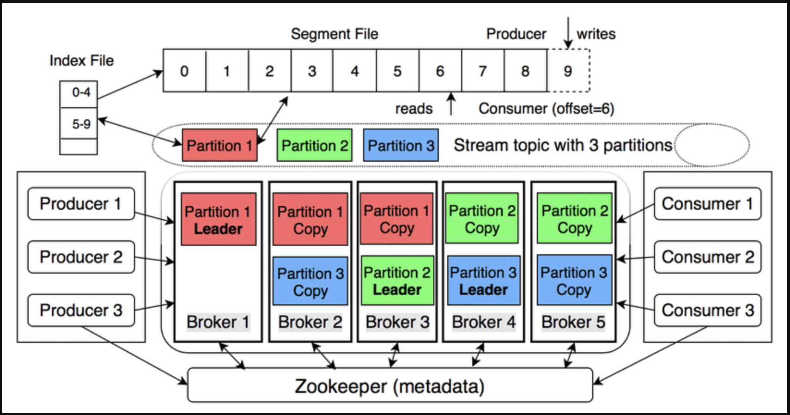

Kafka được mô tả là “distributed commit log” – một hệ thống phân tán lưu trữ luồng sự kiện theo thứ tự, có khả năng phát lại và chịu lỗi cao .

## 1. Kiến trúc tổng quan



| **Thành phần** | **Chức năng chính** |
| --- | --- |
| Broker | Máy chủ Kafka lưu trữ và phục vụ dữ liệu. |
| Topic | Luồng dữ liệu logic; chia thành Partition. |
| Partition | Một log chỉ ghi thêm (append-only), có offset tăng dần – đảm bảo thứ tự trong partition. |
| Producer | Gửi message (key-value) vào topic; key quyết định partition (hash). |
| Consumer | Đọc message theo offset; không xóa dữ liệu. |
| Consumer Group | Nhóm consumer chia đều các partition để scale ngang. |
| Replication | Mỗi partition có 1 leader và n follower; leader nhận ghi, follower sao chép để chịu lỗi . |
| Controller | Broker được bầu làm controller (thay ZooKeeper ở bản mới) điều phối leader/follower . |

## 2. Nguyên lý hoạt động

a) Ghi dữ liệu

- Producer gửi record → Broker leader của partition → append vào log.
- Message được flush xuống đĩa theo cấu hình (mặc định 7 ngày hoặc khi đầy).
- Replication đồng bộ sang follower (ack=all để đảm bảo zero-loss).

b) Đọc dữ liệu

- Consumer poll() liên tục và commit offset (tự động hoặc thủ công).
- Nhiều consumer group đọc cùng topic độc lập – tính năng “replay”.

c) Guaranteed ordering

- Chỉ trong cùng partition; nếu cần toàn cục, dùng key hoặc 1 partition.

## 3. So sánh nhanh với RabbitMQ

| Điểm | Kafka | RabbitMQ |
| --- | --- | --- |
| Mô hình | Partitioned log | Queue |
| Ordering | Trong partition | Trong queue (single consumer) |
| Retention | Policy-based (ngày, GB) | Ack-based (xóa khi ack) |
| Scale | Horizontal (add broker) | Vertical (add queue) |
| Replay | Có | Không (đã ack thì mất) |
|  |  |  |

## 4. Các câu hỏi thường gặp với Apache Kafka

### Vai trò của ZooKeeper trong hệ thống Kafka là gì?

Zookeeper giống như tên của nó (người canh giữ sở thú), là quản gia quản lý toàn bộ hệ thống Kafka. Dưới đây là một số vai trò chính của Zookeeper:

- Lưu trữ metadata toàn cụm
    - Danh sách broker đang sống
    - List topic, partition, replica assignment
    - ISR (In-Sync Replicas) của từng partition
    - ACLs & quota
    - Clients (producer/consumer) đọc metadata này qua các broker; broker lấy từ Zookeeper.
- Điều phối leader election
    - Mỗi partition có 1 leader và n follower.
    - Khi broker chết hoặc ISR thay đổi, controller broker (được bầu bằng Zookeeper) kích hoạt leader election → chọn leader mới cho partition tương ứng.
- Cấu hình & thay đổi cluster
    - Khi admin tạo topic, thay đổi replication-factor, ACL… thay đổi được ghi vào Zookeeper → controller cập nhật và phổ biến cho broker.
- Không làm gì
    - Không lưu message dữ liệu thật.
    - Không tham gia vào việc producer/consumer gửi/nhận record.
- Zookeeper = “bộ não metadata & coordinator” của Kafka (ở phiên bản pre-KRaft); nó bảo đảm cluster biết “ai đang sống, ai là leader, topic nào ở đâu” và tự động cân bằng lại khi có sự cố.

### Kafka Raft là gì?

Kafka Raft – gọi tắt là KRaft – là giao thức đồng thuận (consensus protocol) do Apache Kafka phát triển để loại bỏ hoàn toàn sự phụ thuộc vào ZooKeeper khi quản lý metadata của cụm. Nó được triển khai từ Kafka 3.3.1 

KRaft biến Kafka thành “self-contained distributed streaming platform” – vừa lưu dữ liệu, vừa tự quản lý metadata bằng Raft bên trong.

### So sánh giữa ZooKeeper và Kafka Raft?

| **Tiêu chí** | **ZooKeeper mode (pre-Kafka 2.8)** | **KRaft mode (Kafka ≥ 2.8, mặc định từ 4.0)** |
| --- | --- | --- |
| **Vai trò** | Hệ thống metadata & leader-election bên ngoài Kafka | Metadata & controller được tích hợp vào Kafka qua Raft consensus |
| **Số hệ thống cần vận hành** | 2 (Kafka + ZooKeeper cluster) → 5–7 JVM | 1 (Kafka-only) → chỉ cần 1 JVM cho dev/test |
| **Cấu hình** | `zookeeper.connect`, ACL ZooKeeper, SSL ZooKeeper… | `controller.quorum.voters`, `controller.listener.names` – không còn ZK configs |
| **Metadata storage** | ZK znodes | Internal topic `__cluster_metadata` (event-sourcing, replayable) |
| **Số partition giới hạn** | ~200 k (vì ZK bottlenecks) | >200 k (mục tiêu hàng triệu) |
| **Thời gian tạo/đổi partition** | Tuyến tính, chậm | Hằng số, nhanh (10×) – 42 s vs 600 s khi reassign 10 k partition |
| **Fail-over controller** | 10–30 giây (phụ thuộc ZK session timeout) | Gần như tức thì, ~1 s |
| **Security** | Phải duy trì 2 mô hình: Kafka SASL/SSL + ZK ACL | Một mô hình duy nhất, đồng bộ |
| **Khởi động dev/test** | Cần khởi động ZK trước | Chạy `kafka-server-start.sh` một lệnh là xong |
| **Cấu hình động** | Hỗ trợ `advertised.listeners`, `leader.imbalance.*` động | Cần restart để thay đổi (config static) |
| **Migration path** | N/A | Bắt buộc nếu lên Kafka 4.0 – dùng công cụ `kafka-storage` & KIP-833 |

### Trong Kafka tôi có 3 topic, mỗi topic tôi có 3 partition, thì Kafka sẽ tạo bao nhiêu partition?

Kafka sẽ tạo tổng cộng 9 partition:

3 topics × 3 partitions/topic = 9 partitions.

### Partition của Kafka có phải là queue không?

Không. Một partition của Kafka không phải là một queue truyền thống (FIFO); nó là một append-only log (commit log):

- Dữ liệu được ghi liên tục vào cuối file log (offset tăng dần).
- Consumer chỉ đọc tuần tự theo offset; không xóa dữ liệu sau khi đọc.
- Không pop(), poll(), peek() như queue; message vẫn nằm yên đó cho đến khi retention chính sách xóa (time/bytes).

### Làm sao để biết Consumer đã consume tới offset nào?

Consumer “nhớ” offset bằng cách tự commit (hoặc để Kafka commit giùm) và lưu offset vào topic đặc biệt __consumer_offsets:

- Sau khi xử lý xong batch, gọi:
    - `consumer.commitSync()` – chặn cho tới khi broker ACK.
    - `consumer.commitAsync()` – không chặn, có callback.
    - Hoặc bật enable.auto.commit=true (mặc định), Kafka tự commit mỗi [auto.commit.interval.ms](http://auto.commit.interval.ms/)
- Broker lưu bộ 3-tuple: ([group.id](http://group.id/), topic, partition) → offset vào partition của __consumer_offsets
- Khi consumer khởi động lại:
    - Gửi request OffsetFetch để lấy offset cuối cùng đã commit.
    - Tiếp tục poll từ offset đó trở đi (hoặc theo policy auto.offset.reset nếu chưa có offset).
- Consumer không cần lưu offset ở phía mình; offset luôn được quản lý trung tâm bởi Kafka.

### Một broker của kafka có phải là một server không?

Có — 1 broker của Kafka chính là 1 máy chủ (server) vật lý hoặc ảo, chạy 1 tiến trình JVM (`kafka-server-start`).

Tuy nhiên, có thể:

- 1 server chạy 1 broker (đúng 1:1).
- 1 server chạy nhiều broker nếu bạn muốn test multi-broker trên máy cá nhân (thay đổi port, log.dirs).

Trong thực tế production, 1 broker = 1 server để đơn giản vận hành và tránh I/O, port, resource conflict.

### Cấu trúc lưu file log trong Kafka như thế nào?

```bash
<log.dirs>/                       # thư mục cấu hình của broker
├── topicA-0/                    # partition 0 của topicA
│   ├── 00000000000000000000.log # segment chứa message
│   ├── 00000000000000000000.index
│   ├── 00000000000000000000.timeindex
│   ├── leader-epoch-checkpoint
│   └── ...
├── topicA-1/                    # partition 1 của topicA
├── topicA-2/                    # partition 2 của topicA
├── topicB-0/                    # partition 0 của topicB
...
```

- Dữ liệu thật nằm trong file .log (binary).
- File .index & .timeindex giúp tìm kiếm nhanh theo offset và timestamp (memory-mapped).
