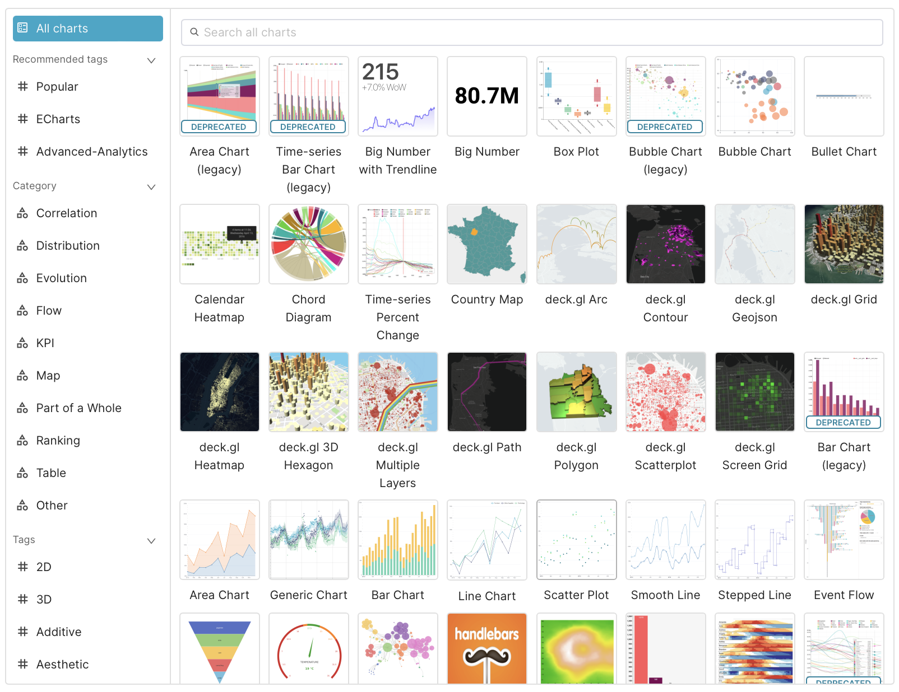
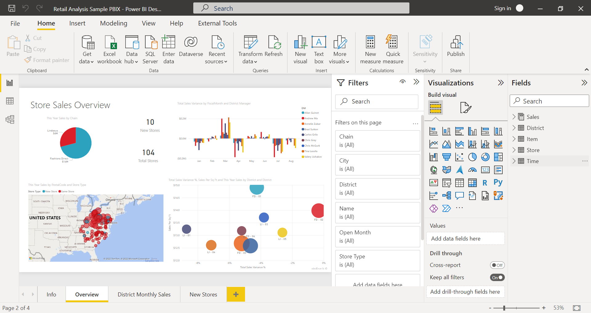

When developing a system or an application, aside from operational issues, reporting is also an essential component of applications. Through reports, management can understand the current business situation of the company, identify issues, and promptly implement solutions to ensure profitability for the company.

<!-- truncate -->

A report can take many types, such as tables, maps, charts, etc. Developing such reports requires a significant amount of time (both on the Backend and Frontend), leading to considerable effort and potentially causing delays in business operations.

Apache Superset was created to make report generation less labor-intensive while still delivering maximum effectiveness. Now, let’s start exploring it together!

## 1. What is Apache Superset?

Apache Superset is an open-source software developed by Airbnb, designed for dynamic data visualization and effective reporting.

Superset provides an intuitive, user-friendly interface, allowing users to create charts and maps from a wide variety of data sources.

## 2. Advantages and Disadvantages of Apache Superset

### a. Advantages

* Open source: means you can use it for free, and there is a community of users who always contribute and improve the quality of the product

* Easy to use: user-friendly interface, you do not need to be a data expert to be able to use it and still create beautiful Dashboards and maps

* Diverse types of maps and charts: Superset provides you with a large number of free maps and charts. However, you can completely add other charts

* Support for many diverse data sources: Superset currently supports all the most popular types of databases today such as Postgres, MySQL, ... In addition, for databases that are not yet supported (such as MongoDB), you can completely connect through distributed query tools such as Trino, Presto, ...

### b. Disadvantages

Besides the advantages we mentioned above, Superset also has the following disadvantages:

* Complicated installation and configuration: for beginners, or those who are not IT-oriented, installing and configuring Superset will be very difficult.

* Limited interface customization: Superset is quite limited in terms of interface customization, you can only change simple interfaces through the provided configuration or the CSS embedded in each Dashboard

* Lack of official support: Because it is open source, Superset does not have an official supporter, but users will rely on solutions from the community if they encounter problems

## 3. Compare Apache Superset with other software

Similar software to Apache Superset we can mention as follows:

### a. Tableau

Considered the most powerful tool in the data analysis industry

It is a commercial software, copyrighted, and there is no free version

The interface is rated as easy to use, intuitive, and does not require a person with too much programming experience to create all kinds of charts and reports

Has good performance

### b. PowerBI

There is a free version but it only stops at basic functions. The paid version has more advanced features

Good integration with the Microsoft ecosystem

Has advanced analytics capabilities, good calculation support via Dart language, and has the ability to integrate Azure ML machine learning models

Easy to use and deploy

### c. Metabase

Similar to Superset, this is a free and open source software

Easier to use than Superset, users do not need to know SQL to create charts and reports

Although easy to use, Metabase has fewer features than Superset, and is not suitable for too complex calculation requirements

Next article, we will learn how to install Superset.