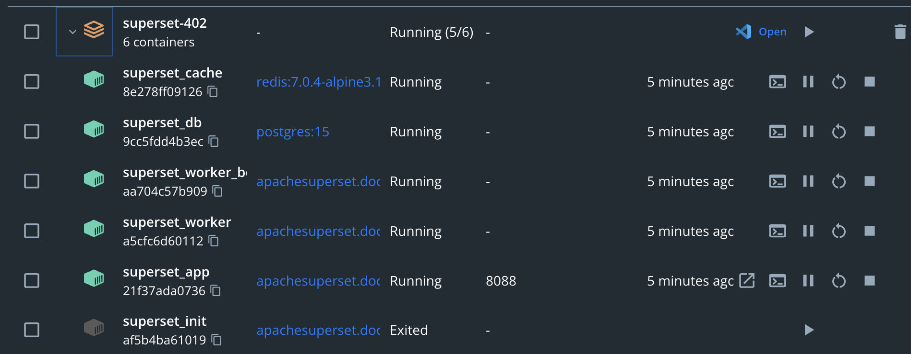

Today, we will guide you how to install Superset on your personal computer, so you can freely research.

<!-- truncate -->

## 1. Preparing

First, to be able to install Superset, we need to download and install Docker at: https://www.docker.com/. This is an open source platform used to deploy, manage and operate applications in containers.

When we run Superset on Docker, it will run independently without having to install other software on your personal computer such as Python, Postgres, Redis, Node ...


## 2. Step to install Apache Superset

### Step 1: Download the source code of Apache Superset

You have 2 ways to download the source code of Superset:
- Method 1: Use git, run the command `git clone --depth=1 https://github.com/apache/superset.git`, you will get the latest version of Superset
- Method 2: Download the source code directly from Github
* Go to the Superset source code website: https://github.com/apache/superset/releases
* Select the version you want to download, as in the picture I choose the latest version 4.0.2
* You can download in zip or tar.gz format. Then, unzip it


### Step 2: Run Apache Superset

After unzipping, we will see the docker-compose file in the Superset folder. There are 2 docker-compose files:
- `docker-compose.yml`: version used for development environment. You can change the source code of Superset, then run it with the docker-compose command
- `docker-compose-non-dev.yml`: used for production environment

The simple way to run is to start the app with docker-compose

```shell
docker-compose -f docker-compose-non-dev.yml up -d
```


## 3. Components in the installation package

After installation, you will see on the Docker Dashboard screen, there will be the following components:



- superset_app: this is the main component of Superset, including both Backend and Frontend
- superser_cache: used to cache information on Apache Superset, helping to increase speed when accessing to view reports. Cache uses Redis
- superser_db: used to store necessary information (Metadata) of Superset such as: Dashboard, Chart, user authorization, ... This DB is using Postgres
- superset_worker: used to run tasks such as async query, or snapshot reports, send emails
- superset_worker_beat: executes additional scheduler and interacts with worker to do certain tasks. These components are using Celery

## 4. Go to Superset website

After the Superset components have finished running, you access http://localhost:8088 to open Superset, log in with the default Superset account:
- Username: admin
- Password: admin


So you have completed the installation of Superset.

