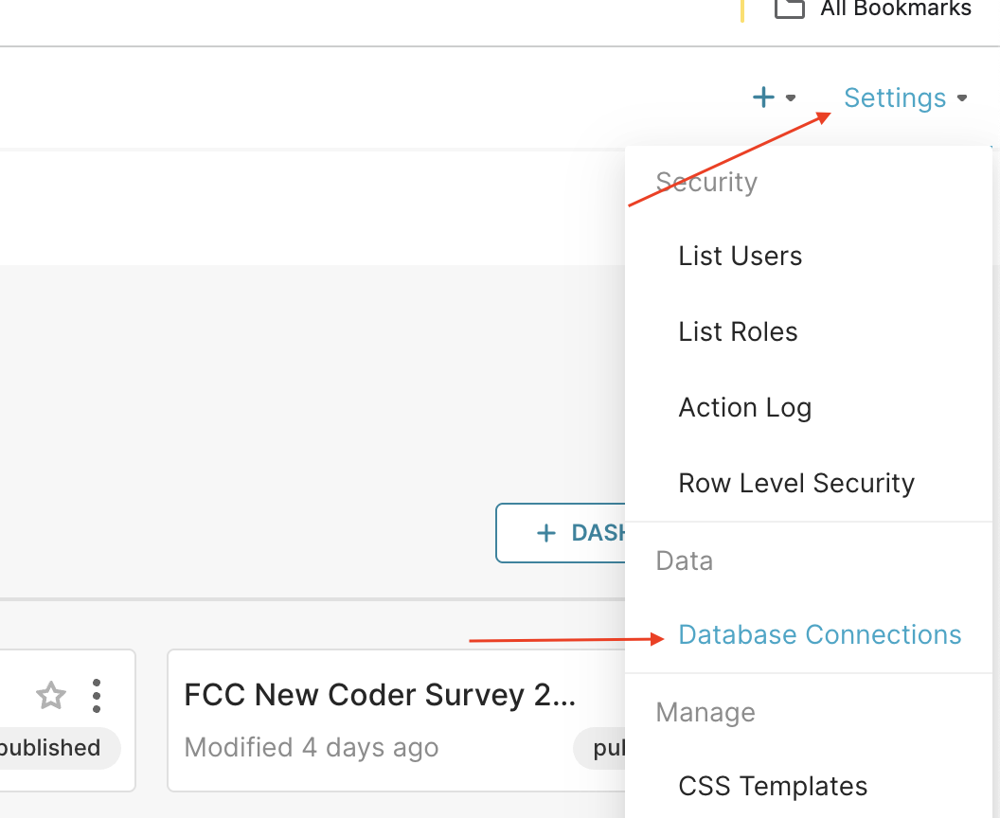

In the previous post, I [instructed you how to install Apache Superset](/2024-10-01-cai-dat-superset). After installation, the first thing we want to think about is how to make a dashboard and report using Superset. In this post, I will guide you step by step to make a report, with illustrative images.

<!-- truncate -->

## 1. Process Summary

To be able to make a Dashboard with Superset, the prerequisite is that you need to have a data source, which means where will you get the data from to make the report. As I shared in the article [Introduction to Superset](/2024-09-30-tim-hieu-ve-apache-superset), currently Superset can support many different data sources such as Postgres, MySQL, Clickhouse, Microsoft SQL Server, ...

After identifying the data source, you need to connect Superset to your data source

Next, from that data source, you need to create Datasets on Superset. Reports on Superset do not work directly with your data source, but will work through Datasets

From those Datasets, we can create charts. Arranging 1 or more charts together on one screen, that screen is called Dashboard

Now, let's go through it step by step.

## 2. Connect Superset to Datasource

As I mentioned in part 1, the first thing we need is to connect to the data source we want to make a report. To connect to the data source, we do the following steps in sequence:

Step 1: You use an account with Admin rights, click on the Settings menu in the upper right corner of the screen -> select Database Connections

Step 2: Select the Database type according to your database source. For example, here I will choose Postgres

Step 3: Fill in all necessary information such as host, port, DB name, user, password to connect to the Database that needs to get data for your report.

Step 4: After successfully connecting, you will move to the final configuration screen, here I am most interested in the SQL Lab section. Here, you can grant additional permissions to be able to interact with your DB through SQl Lab

After successfully connecting to the Database, you will see your DB in the list.

That's on, the Datasource connection is successful.
