Table charts are one of the most popular and simplest types of charts when making reports. The purpose of these charts is to help viewers see the specific numbers of each criterion. They can be viewed in a certain order, or simply listed by column in your Dataset.

<!-- truncate -->

## 1. Types of Table Charts

When you go to the Charts menu of Superset, select the chart type as Table, you will see that Superset has 3 types for us to choose from, which are: Table, Pivot Table, Time-series Table. Depending on the specific needs of the given problem, you will choose the appropriate chart type.

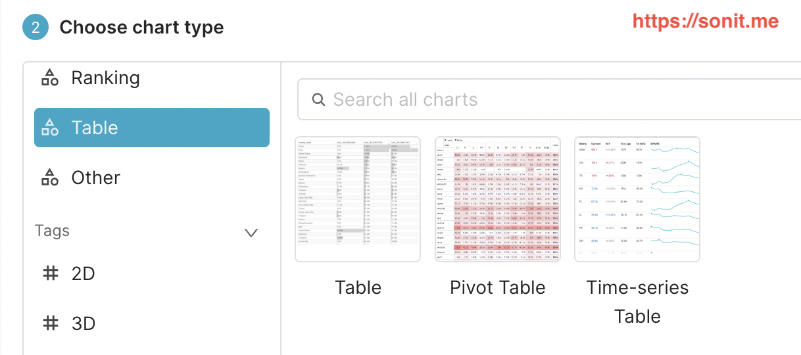

Below, I will give detailed instructions for each type

## 2. Create a table chart

### a. Introduction

A table chart is a simple chart, displayed in horizontal rows and columns similar to Excel

Purpose: used to display detailed data, such as transaction lists, order lists, employee lists, student lists, etc. You can see this type of chart in many places, wherever there is data, you can see this type of chart.

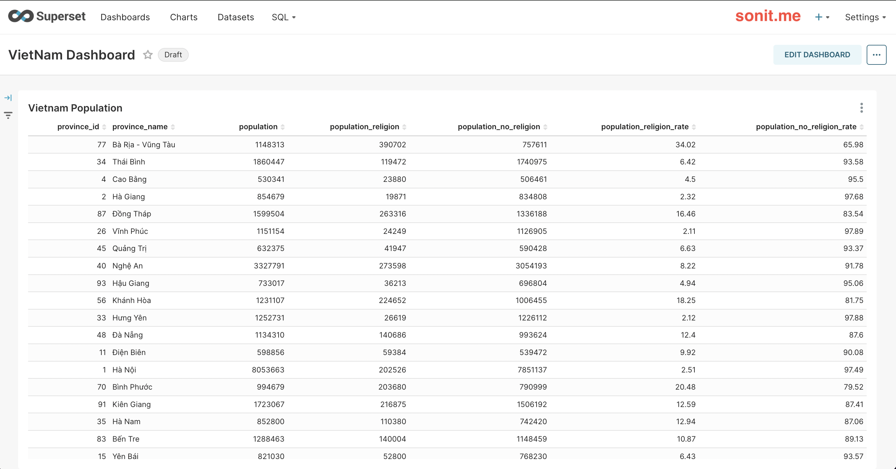

### b. How to create a table chart

The process of creating a chart, I have introduced in the article [How to make a simple report with Superset](/2024-10-09-cach-lam-report-don-gian-bang-apache-superset-phan-2). To create a table chart is very simple, you just need to select which columns need to be displayed on your chart, then click Update Chart, then you can see your results on the right side

## 3. Create a Pivot Chart (Pivot Table)

### a. Introduction

Pivot Table is a type of chart that groups similar criteria, and can calculate numbers based on those criteria.

Purpose: to help quickly view statistics according to the criteria that the viewer wants.

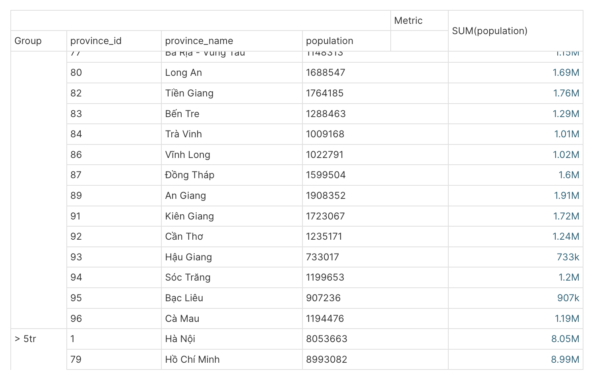

For example: as shown above, I want to group which provinces have a population > 5 million people, and which cities have < 5 million people

### b. How to create a table chart

Step 1: You need to select the Chart type as Pivot Table

Step 2: Pivot Table requires you to have 2 parts:
* 1. Dimension (you want to group by what criteria), there are 2 types: Row (view by row) and Column (view by column)
* 2. Metric (what calculation do you want to use for your Dimension), for example Sum, Average, Min, Max, ...

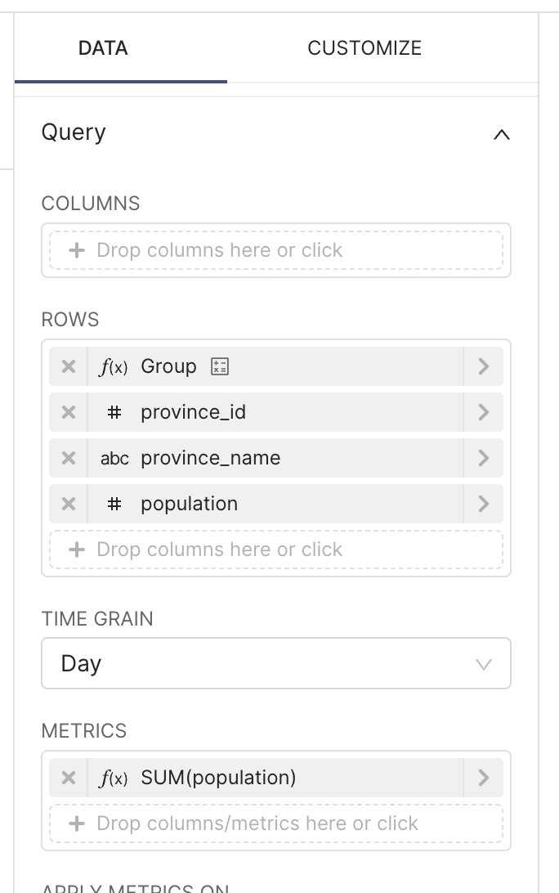

## 4. Create a Time Series Chart (Time-series Table)

### a. Introduction

Time-series table is a type of chart used to view data trends over time. For example, in 1 week, I want to see my business results by day, whether they increase or decrease, I can use this chart

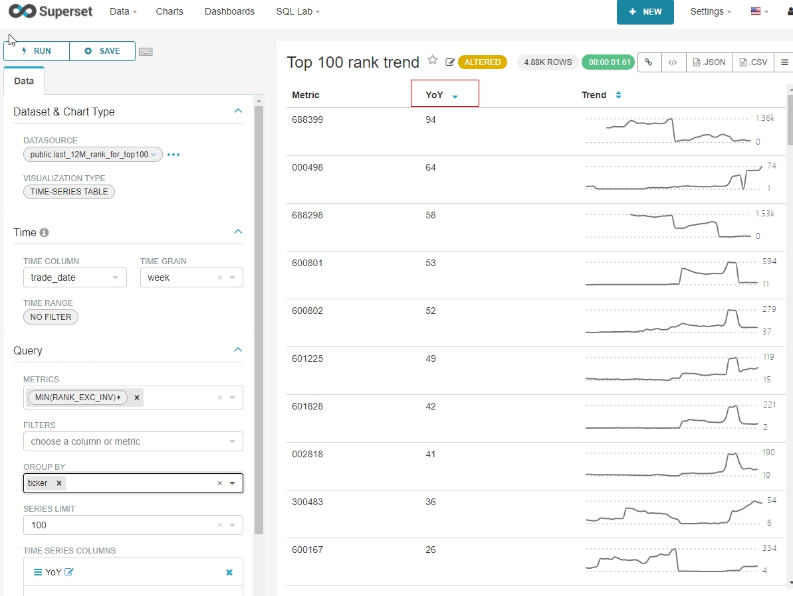

This chart helps users to view trends

:::warning

Note: to be able to build a Time-Series chart, your dataset must have a column to determine the time we need to view the trend. For example: creation date, update date, ...

:::

### b. How to create a Time-Series chart

Step 1: You need to select the Chart type as Time-series Table, and select the Dataset needed to make the report

Step 2: On the Time-series Table, there will be a few of the following properties:
- Time Column: select the column with the timestamp data type in the Dataset
- Time Grain: select the time level you want to see the trend (by day, by week, by month ...)
- Metrics: select the data type you want to see
- Time series columns: select the type you want to see (number, line, ...)

## 5. Some tips when working with table charts

### a. How to rename columns

Usually, Superset will take the column name in Dataset as the column name of the report. This will not be user-friendly, but will most likely cause confusion for users.

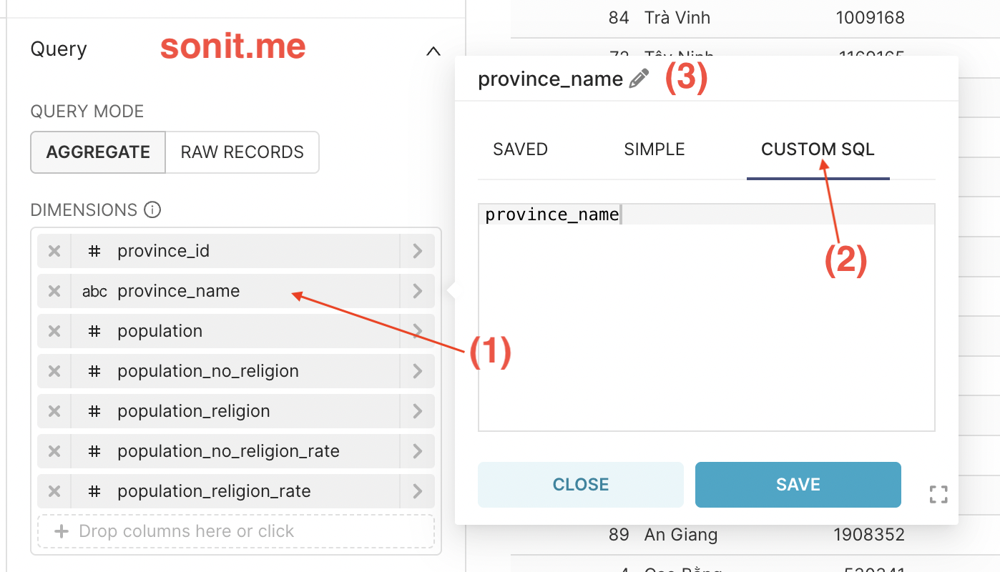
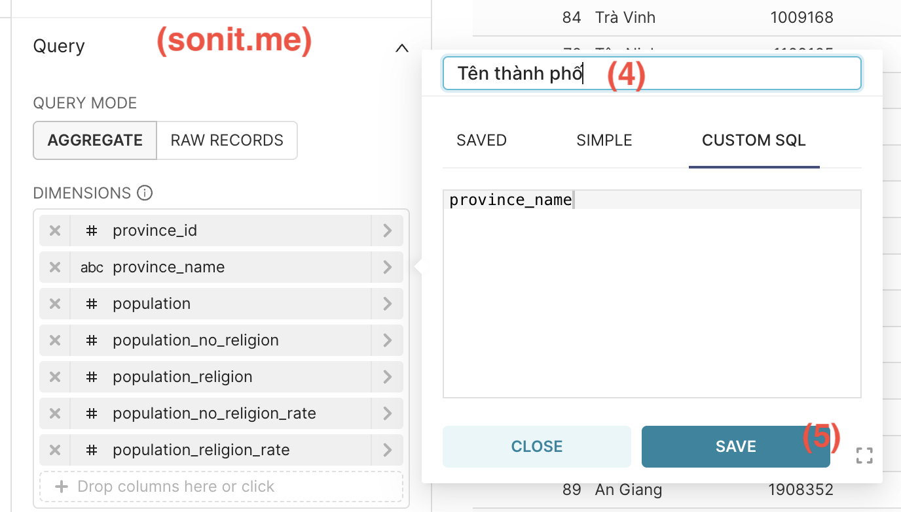

To change the column name, follow these steps:
- Step 1: Click on the column you want to rename
- Step 2: Select the `CUSTOM SQL` tab
- Step 3: Click on the pen on the header
- Step 4: Rename it as desired
- Step 5: Click Save

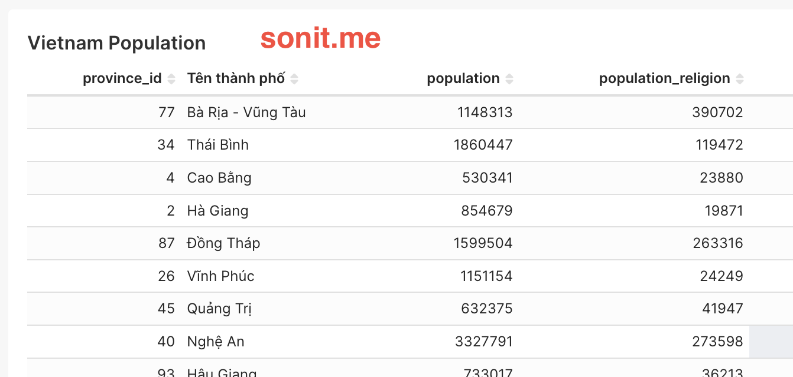
### b. Filtering displayed data

- This data filtering section is available on almost all charts
- The purpose is to filter out the data you want to display on the chart. For example: you have a dataset with all the provinces of Vietnam. If you want to make a chart that only displays data from the South, this is an effective choice
- You can use it in a simple way by selecting the column and the conditions to display. Or you can write a query in the `CUSTOM SQL` tab to create filters with higher complexity, or combine multiple conditions together

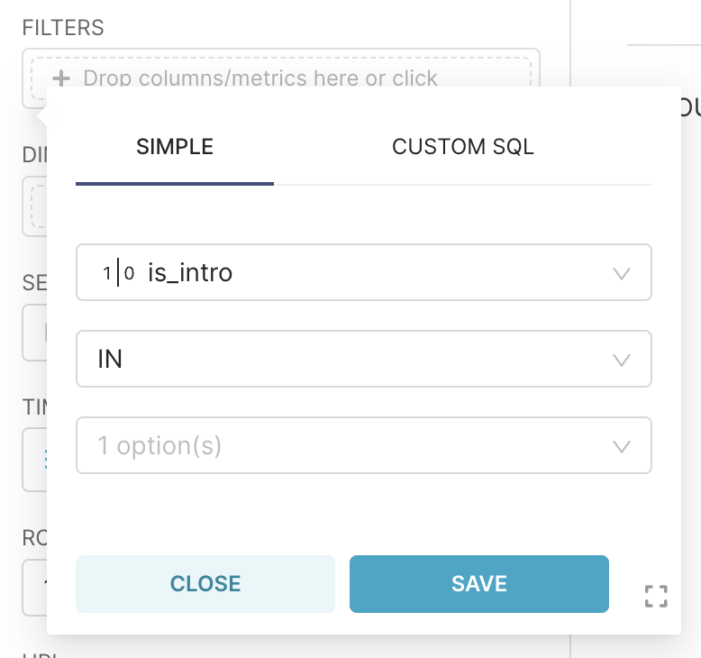

### c. Sort data by condition

- You select the column to sort by the `SORT BY` attribute
- Below, you will see the `SORT DESCENDING` check box. If you check this checkbox, your data will be sorted from high to low, otherwise from low to high

### d. Add data search box

- Apply to original Table chart (by row and column)
- Use to search for keywords in the table
- Click on the `CUSTOMIZE` tab, tick the `SEARCH BOX` box. So we can search for data in the Table

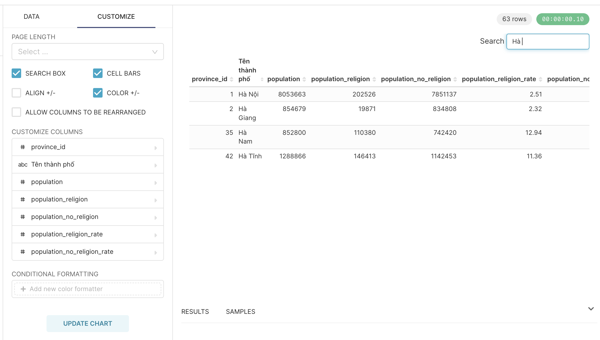

### e. Paging

- Also applies to the original table
- This paging is necessary when the amount of data you need to display has a lot of rows
- Click on the `CUSTOMIZE` tab, right in the `PAGE LENGTH` section, you choose the number of rows you want to display in 1 page, then Superset will automatically display the page number

- However, this is only the method on the Frontend and is not optimized for performance if you have many rows of data. Therefore, Superset allows you to paginate from the Backend (Server) by ticking the checkbox `SERVER PAGINATION`

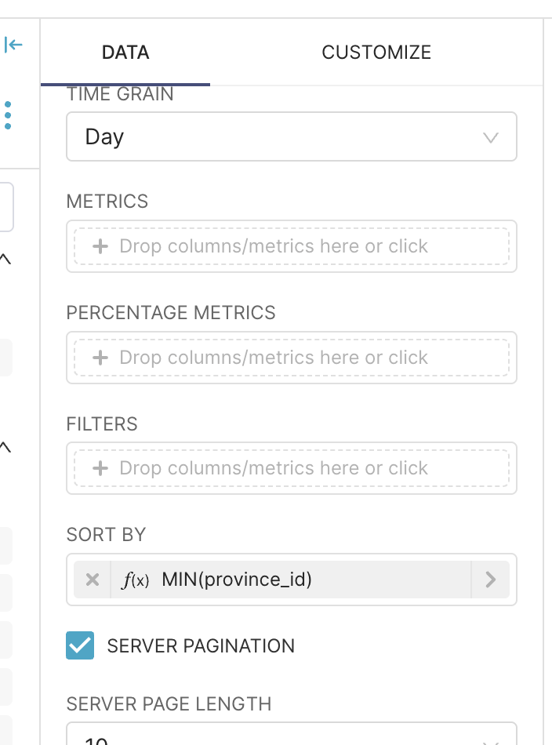

### f. Format letters and numbers

- By default, Superset will display all numbers, or format numbers, dates and months according to the default format. We can change the format as desired
- Click `CUSTOMIZE`, select the column you want to change the format -> a popup appears, select the `NUMBER FORMATTING` tab
- Superset is using D3 Format (https://github.com/d3/d3-format). If any formats Superset does not have in the list, you can completely type the format directly according to D3

- To format the day, month, year, you choose the desired display format in the `TIMESTAMP FORMAT` attribute

