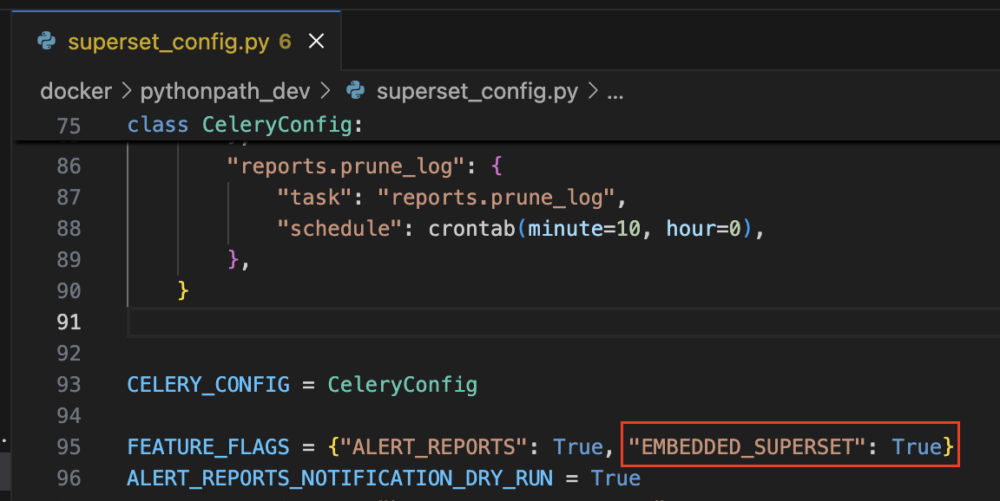
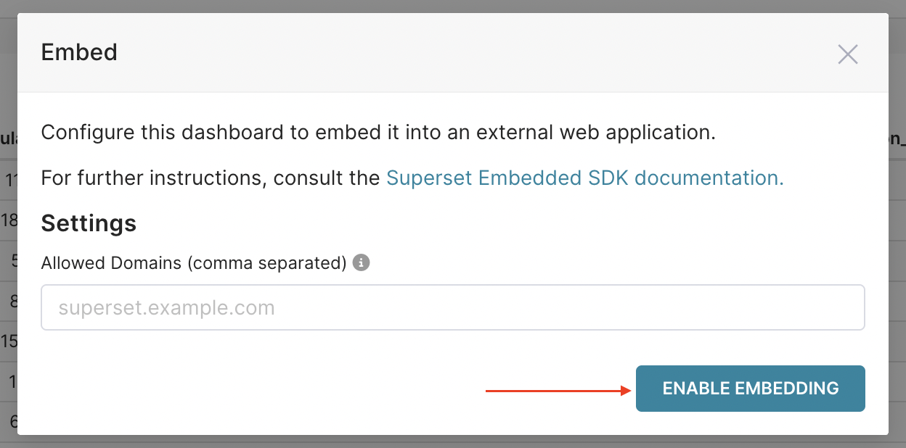
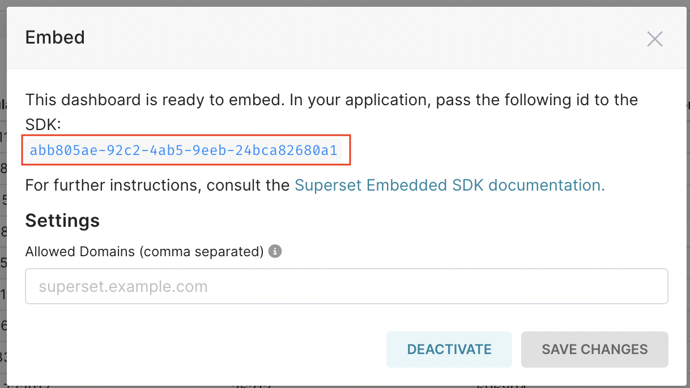
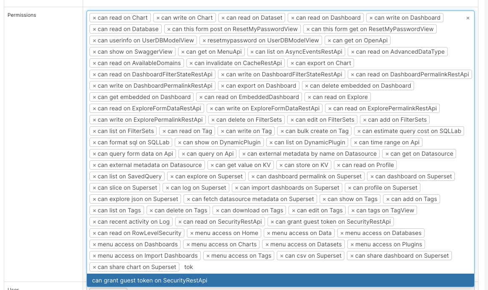
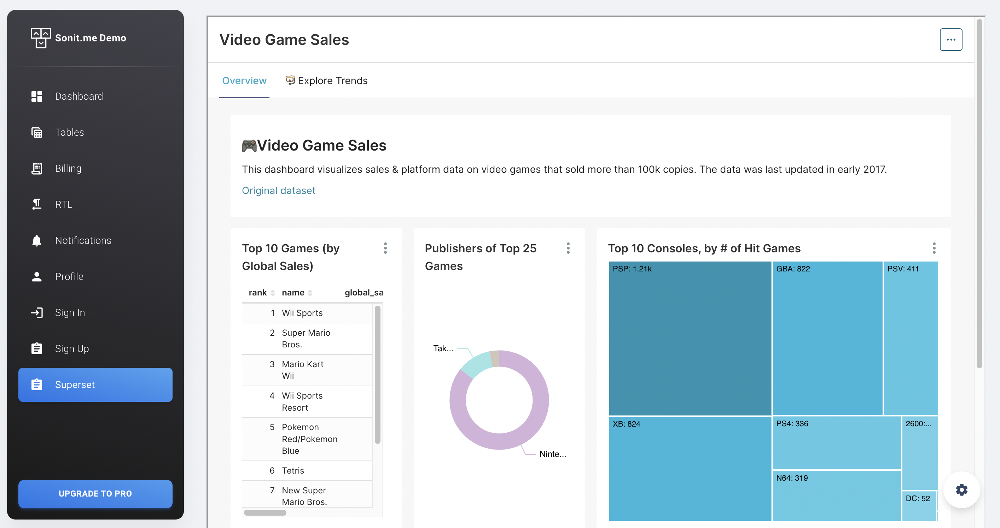

One good thing about Apache Superset is that you can embed the completed dashboard into any of your websites. This is really a good thing because we can make reports quickly without spending too much time and resources to build Backend, Frontend.

<!-- truncate -->

To be able to embed Superset into your website, we need to integrate both your Backend and Frontend with Superset. Now let's start learning how to embed an Apache Superset dashboard into your website.

## 1. How to get the UUID of a Dashboard on Superset

### a. Setting environment variables

- First, to enable the function to embed a Superset Dashboard into any website, we need to set up the Superset environment variable

- If you deploy using Docker, open the file `docker/pythonpath_dev/superset_config.py`, find the line `FEATURE_FLAGS`, and add the variable `EMBEDDED_SUPERSET` to the config with the value `True`



Remember, after finishing the configuration, you need to restart your container to receive the environment variable

### b. How to get Dashboard UUID

Each Dashboard has a unique key, formatted according to the UUID format. To embed it into the website, Superset needs to know which Dashboard you want to embed, so you need to get the UUID of the dashboard you want to embed

After opening the `EMBEDDED_SUPERSET=True` configuration, follow these steps to get the UUID:

- Step 1: open the dashboard you want to embed
- Step 2: Click on the three dots in the upper right corner, then select `Embed dashboard`


- Step 3: A small popup appears, click the `ENABLE EMBEDDING` button



- Step 4: you will see the UUID of this dashboard, this is the key of the dashboard for integrating into the website. You need to note this key to do the next steps



## 2. Backend

### a. Goals

- Directly integrate with Apache Superset API, including: authentication, authorization, get Guest Token to provide FE embedded in Superset

- Integrate with Superset on the Backend to ensure security, avoid revealing sensitive information such as username, password

### b. Steps to integrate with Apache Superset

**Step 1: Call API login to get access token**

```shell
curl --location '{{superset_domain}}/api/v1/security/login' \
--header 'Content-Type: application/json' \
--data '{
  "password": "{{user_login}}",
  "provider": "db",
  "refresh": false,
  "username": "{{password_login}}"
}'
```

:::warning
- user_login / password_login: account login to Superset. This account must have the right **can grant guest token on SecurityRestApi**

- superset_domain: domain of the superset website
:::

**Step 2: Call API to get csrf token**

```shell
curl --location '{{superset_domain}}/api/v1/security/csrf_token/' \
--header 'Authorization: Bearer {{access_token}}'
```

:::warning
- access_token: taken from the output of the login API in step 1
:::

**Step 3: Call API to get guest token**

```shell
curl --location '{{superset_domain}}/api/v1/security/guest_token/' \
--header 'X-Csrftoken: {{csrf_token}}' \
--header 'Authorization: Bearer {{access_token}}' \
--header 'Content-Type: application/json' \
--data '{
    "resources": [
        {
            "id": "{{dashboard_uuid}}",
            "type": "dashboard"
        }
    ],
    "user": {
        "username": "{{user_login}}"
    },
    "rls": [{
        "clause": "team_id IN (1)"
    }]
}'
```

:::warning
- access_token: taken from the output of the login API in step 1
- csrf_token: taken from the output of the login API in step 2
- dashboard_uuid: the uuid of the dashboard is taken from section [1]
:::

:::warning
rls (Row Level Security): often used to authorize data according to row level in Dataset. As in the example above, I only get data of team with ID = 1
:::

## 3. Frontend

### a. Goals

- After getting the guest token on the Backend, the next thing we need to do is to display the Superset dashboard on the website.

- Apache Superset provides us with an SDK library for React JS, so we can easily put our dashboard on the website

### b. Implementation steps

**Step 1: Install Superset Embed SDK**

```shell
npm install --save @superset-ui/embedded-sdk
```

**Step 2: Embed SDK into the website where you want to display Dashboard**

```js
import { useEffect } from "react";

import DashboardLayout from "examples/LayoutContainers/DashboardLayout";

// Import Superset SDK
import { embedDashboard } from "@superset-ui/embedded-sdk";

// This function calls API to Backend to get Guest Token
const getToken = async () => 'eyJ0e...';

function Superset() {
    useEffect(() => {
        const embed = async () => {
            embedDashboard({
                id: "{{dashboard_uuid}}", 
                supersetDomain: "{{superset_domain}}",
                mountPoint: document.getElementById("superset_dashboard"), 
                fetchGuestToken: () => getToken(),
                iframeSandboxExtras: ['allow-top-navigation', 'allow-popups-to-escape-sandbox']
            });

            const iframe = document.getElementById('superset_dashboard')?.querySelector('iframe')

            if (iframe) {
                iframe.style.width = '100%'
                iframe.style.height = '800px'
            }
        }

        if (document.getElementById('superset_dashboard')) {
            embed()
        }
    }, [])

    return (
        <DashboardLayout>
            <div id="superset_dashboard" />
        </DashboardLayout>
    )
}

export default Superset;
```

Finally, let's see the result



