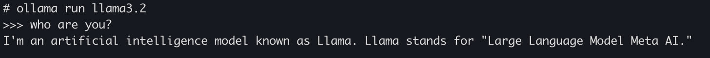

Nowadays, we can easily access AI chat applications, the most famous of which are ChatGPT by OpenAI, Gemini by Google, Copilot by Microsoft, ... These software are almost free for a normal user, except in cases where you want to use more advanced features, you need to pay to upgrade.

However, if you want to try to build your own personal assistant on your personal computer, and want to freely choose the model, please see the article below, I will guide you in detail.

<!-- truncate -->

## 1. Introduction


In the past, installing an AI model in general and LLM in particular on a personal computer could be said to be very difficult. They require very high computer configuration requirements, and go through a very complicated installation process. If your computer only uses a CPU without a separate graphics card, it is extremely difficult.

However, in recent years, with the emergence of many large language models (LLM), led by ChatGPT, it has brought people closer to AI, even ordinary people or those working in other fields, not related to Computer Science can still use AI. Next, with the desire to master their technology, the programming community as well as large organizations have launched many large open source language models, such as Google's Gamma (which can be considered a part of Gemini), Meta's Llama, and dozens of other open source models, which can help people build their own LLM system, or more simply, their own Chatbot system.


In today's article, SonIT.me will guide you on how to build an LLM system on a personal computer with [Olama](https://ollama.com/). Olama is a tool used to manage and run AI models easily on a personal computer, and can be deployed to a physical server.

## 2. Install Docker

There are many ways to install Ollama on your computer, but the simplest way is to install it on [Docker](https://www.docker.com/).


Here, I do not give detailed instructions on how to install Docker, you can refer to the installation instructions here based on the operating system you are using

https://docs.docker.com/desktop/install/mac-install/

## 3. Install Ollama

After installing Docker, the next thing we need to do is find the Ollama Docker Image on Docker Registry Official.

Go to the Ollama official page on Docker Hub ([Click here](https://hub.docker.com/r/ollama/ollama/tags), find the latest version. At the time of writing, the latest version of Ollama is 0.3.14


Next, use the following command to download the docker image and run it. This command runs if you only use the CPU to process

```shell
docker run -d -v ~/ollama:/root/.ollama -p 11434:11434 --name ollama ollama/ollama:0.3.14
```

If your computer has an external Nvidia GPU graphics card, we run the following command to take advantage of the power of the graphics card.

```shell
docker run -d --gpus=all -v ~/ollama:/root/.ollama -p 11434:11434 --name ollama ollama/ollama:0.3.14
```

:::warning
- You need to mount the `/root/.ollama` folder and outside, because the models will be downloaded and saved in that folder. If you do not mount this folder, then every time you run the docker run command, you have to download the model again. This is quite time-consuming because the capacity of the LLM model is very large, it can be from a few GB to a few dozen GB
- Port 11434 is the port for the application to communicate with Ollame via Rest API
:::

## 4. Install the model on Ollama

Ollama is essentially a support tool to run the LLM model. After completing the installation in the above step, we still cannot use it as a normal chat bot, but need to install additional models on Ollama.

First, go to the Ollama library page (https://ollama.com/library) to find a model that is suitable for your computer.


Click on the appropriate model, you will see the installation instructions of any model along with its version. As shown below, I choose the llama3.2 model, you will see the way to install this model is `ollama run llama3.2`


To install the model, we need to access the docker container to run, then run the command as above:

```shell
docker exec -it ollama /bin/sh
ollama run llama3.2
```

After installation is complete, you will see the terminal screen displayed as follows

```shell
# ollama run llama3.2
>>> Send a message (/? for help)
```

Now, try asking a question and see how your BOT will answer?



OK, so the installation is successful. In the next articles, I will guide you to build systems and applications around Ollama.