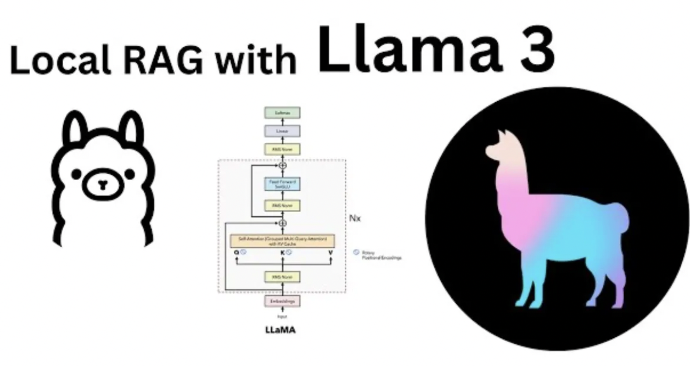

In the previous article, I guided you [how to install Ollama on your personal computer](/2024-11-01-how-to-install-large-language-model-locally), and also guided you how to install a model on Ollama? Continuing the series of articles related to Large Language Model and Ollama, today I will guide you how to build a simple RAG server, integrated with Ollama.

<!-- truncate -->

## 1. What is RAG server?

Retrieval-Augmented Generation (RAG), is a method in natural language processing (NLP) that combines two main components:

- Retrieval: First, the RAG system will search and retrieve information from a large data set or knowledge base. This helps it retrieve relevant information to answer questions or provide context.

- Generation: After having the retrieved information, the system will use a language model to generate answers. It will combine the retrieved information with its natural language generation capabilities to create reasonable and contextually appropriate answers.

## 2. Benefits of using RAG server

Compared to using a normal model, RAG server has the following advantages:

- Improved accuracy: because RAG relies on your data, the answers given by RAG are more accurate
- Fast data updates: instead of needing to retrain the model so that AI can understand your data (costing a lot of resources and time), RAG will directly access your database, updating new data more quickly
- More accurate information provided to customers: RAG will rely on your data to answer customers, so the information that AI provides to customers is more accurate

## 3. RAG applications

With the above advantages of RAG, you can do:

- Chatbot: this is the first thing we will think of, a chatbot that consults on products and takes care of customers anytime, anywhere

- Better search support: because it only extracts from your own data, the search will be more accurate

- Applications that need to update data continuously: such as in healthcare, education, financial analysis, markets. Data will be updated continuously, so the application must also update quickly to be able to give the most accurate answer

## 4. Build a simple RAG server with Golang, Langchain and Ollama

As the model above, the RAG server will connect to LLM (used for natural language processing) and Vector Database containing your own data. In this article, I will give basic instructions on how to get simple data (without using Database) so that you can understand how the RAG server works.

