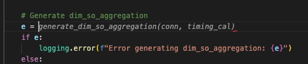

Nowadays, using AI Assistant to support coding is making developers' work easier and more efficient. However, Github products Copilot, Tabnine, Cursor AI ... are all paid products, and the cost of these products is not low, especially for students and those who have just started working. Therefore, in this article, I will share how to use AI Assistant for free to support coding for you.

<!-- truncate -->

## 1. Introduction to AI Assistant


AI Assistant in IDEs is an integrated artificial intelligence (AI) tool designed to support and enhance developer performance in the process of coding, debugging, understanding code and performing tasks related to software development.

Today, there are quite a few AI Assistants developed on the market, the most famous of which are Github Copilot, Cursor AI, Tabnine, ... but these tools are all paid, or the free version is very limited

Today, I will guide you on how to install and use AI Assistant for free on IDEs such as VSCode, IntelliJ IDEA, ...

## 2. Main functions of AI Assistant


AI Assistants will usually have the following basic functions:
- Direct integration into IDE: for AI Assistant to understand your code, what your project is doing, ... it needs to be directly integrated into IDE, helping you write code faster, more efficiently.
- Smart Code Completion: AI Assistant will help you write code faster by automatically suggesting the next lines of code, or suggesting functions, variables, ... according to the context of your project
- Code suggestions: suggesting better ways to write code, popular design patterns
- Code analysis and error detection: Using AI models to analyze code, detect potential errors, security vulnerabilities, performance issues and suggest solutions.
- Answer Code related questions: ask code related questions in the project under development, get answers directly in the IDE.

## 3. Register for a free Mistral account

[Mistral AI](https://mistral.ai/) is a platform that provides artificial intelligence-related products, owned by the French-based company Mistral.

Mistral has a specialized model for writing code, called [Codestral](https://mistral.ai/news/codestral). This is a generative model specifically designed and optimized for code generation, code suggestion, and code improvement tasks. Codestral is trained on more than 80 programming languages, allowing it to work well on both popular and less popular languages.

Currently, you can use Codestral for free directly on the Mistral platform. You need to do the following steps:

- 1. Go to the website https://console.mistral.ai/ and register for an account, or you can use other social network accounts such as Google, Microsoft, Apple to log in.

- 2. After successfully logging in, go to the API Keys menu to create a new API. This key is used to call the Mistral API to ask and answer questions directly on your IDE.


- 3. Next, go to the Codestral menu to create an API key. This API key is used to integrate directly with the IDE, so that it can automatically generate code and suggest code for you


Remember to save these 2 keys so I can continue in step 4

## 4. How to install the AI ​​Assistant (Continue) extension

To integrate with Mistral's API, you need to install the AI ​​Assistant (Continue) extension on VSCode and IntelliJ IDEA. https://www.continue.dev/.

### a. Install Continue on VSCode

Go to the Extensions menu on VSCode, find `Continue` and install


After successful installation, the Continue icon will appear on the left menu. Click on that icon, and follow the steps in the image below to open the config.json file


In the config.json file, you need to edit the following places:

```json
"models": [{ // Configure model for chat with AI
    "title": "Mistral Large", // Set display name of model
    "provider": "mistral", // Leave default as mistral
    "model": "mistral-large-latest", // model name, learn more https://docs.mistral.ai/getting-started/models/models_overview/
    "apiKey": "xxx" // API key registered in step 3.2
}],
"tabAutocompleteModel": { // Configure model for code suggestion
    "title": "Codestral", // Set display name of model
    "provider": "mistral", // Leave default as mistral
    "model": "codestral-latest", // model name for code suggestion, name is codestral
    "apiKey": "xxx" // API key registered in step 3.3
},
"embeddingsProvider": { // Configure model for auto-suggestion message suggestion
    "provider": "mistral", // Leave the default as mistral
    "model": "mistral-embed", // model name for auto-suggestion when sending messages, the name is mistral-embed
    "apiKey": "xxx", // API key registered in step 3.2
    "apiBase": "https://api.mistral.ai/v1" // API link
}
```

After installation is complete, save the file, and you're done

### b. Install Continue on IntelliJ IDEA

Go to Settings -> Plugins -> Marketplace -> Search for Continue -> Install


After installation is complete, the Continue menu will appear on the left side of the IDE. Then, you can configure the model like the installation steps on VSCode


:::tip

If you are using both VSCode and IntelliJ, you only need to setup config in one of the 2 IDEs. Because Continue will read your config in the `.continue` folder in the root folder of the project.(`~/.continue/config.json`)

:::

## 5. How to use

In order for AI to understand your project and provide better support, you need to Index your code. Click on the settings icon -> Indexing


Then, during the coding process, AI will help suggest code for you



In addition, you can also chat directly to ask about code, as well as support bug fixing, finding solutions, and code review


So I have completed the installation and configuration of an AI Assistant on my IDE. In addition to Mistral, Continue supports many other providers such as: Ollama, OpenAI, Claude, Gemini,... You can learn more to choose a model that suits your requirements and budget.