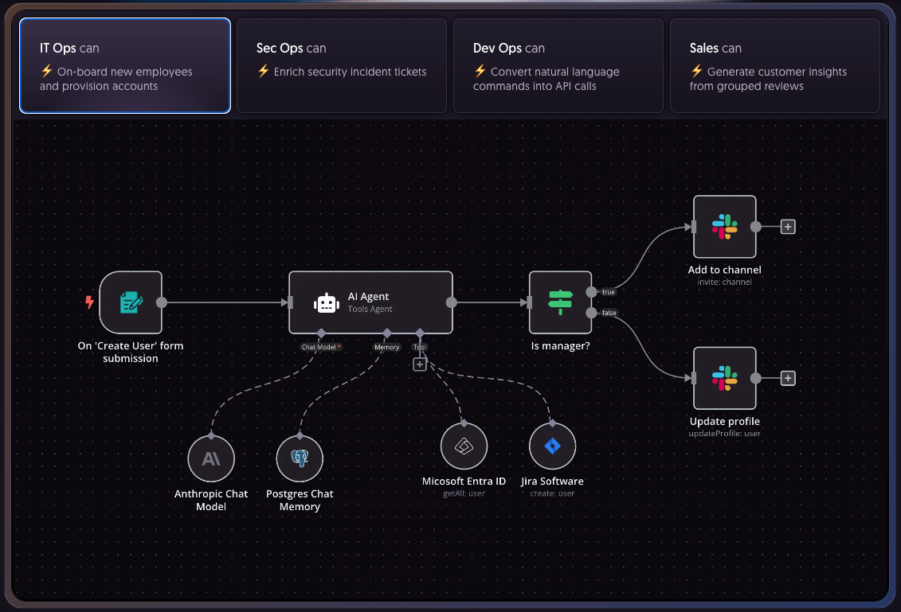

In the past, in the traditional way, when integrating a new service with your system, you would need to write code to integrate. You would need to check the API document, write code, test and deploy. This takes a lot of time and effort.

With the development of No code / low code systems, you can integrate a new service with your system using a user interface, without having to write too much code. And n8n was born to solve that problem. So what is n8n? Is it a powerful tool that you can take advantage of in your systems? Let's start to find out.

<!-- truncate -->

## 1. What is N8n?

N8n is an open-source workflow automation tool that allows users to connect and integrate various applications, services, and tools to create automated workflows.

N8n is developed using Node.js and provides an intuitive user interface for designing and managing workflows. It supports multiple connection types, including HTTP, API, database, email, and more.

N8n is an open-source software that you can use for a paid (Cloud-based) or self-hosted version.



## 2. N8n installation instructions

There are 2 popular ways to install n8n, which are direct installation via npm, and installation via Docker

### 2.1. Install n8n via npm

- n8n requires your machine to have Node.js 18 or higher installed.

- Then, open the terminal, type the command:

```sh
npm install n8n -g
```

- To install a specific version, you can use the command:

```sh
npm install -g n8n@0.126.1
```

- After the installation is complete, you can start n8n with the command:

```sh
n8n
# or
n8n start
```

### 2.2. Install n8n via Docker

- First, you need to create a docker volume to contain data

```sh
docker volume create n8n_data
```

- Next, you use the docker run command to start n8n

```sh
docker run -it --rm --name n8n -p 5678:5678 -v n8n_data:/home/node/.n8n docker.n8n.io/n8nio/n8n
```

- When running the above command, by default n8n will use SQLite to store data. If you want to use PostgreSQL, run the following command:

 ```sh
 docker run -it --rm \
 --name n8n \
 -p 5678:5678 \
 -e DB_TYPE=postgresdb \
 -e DB_POSTGRESDB_DATABASE=<POSTGRES_DATABASE> \
 -e DB_POSTGRESDB_HOST=<POSTGRES_HOST> \
 -e DB_POSTGRESDB_PORT=<POSTGRES_PORT> \
 -e DB_POSTGRESDB_USER=<POSTGRES_USER> \
 -e DB_POSTGRESDB_SCHEMA=<POSTGRES_SCHEMA> \
 -e DB_POSTGRESDB_PASSWORD=<POSTGRES_PASSWORD> \
 -v n8n_data:/home/node/.n8n\
docker.n8n.io/n8nio/n8n
```

- After successfully booting, you can access n8n by opening your browser and accessing the address `http://localhost:5678`

## 3. Build a simple workflow on n8n

In today's article, I will guide you to build a simple workflow on n8n according to the following model:

### 3.1 Workflow design


**Workflow description**
- [1] The user will upload an audio clip (or record file) to Telegram
- [2] The system will validate whether the audio file uploaded to Telegram is valid or not? Here I will validate the file size and file format
- [3] If the file is valid, Telegram will download the file and save it to the local folder
- [4] After successfully downloading the file, OpenAI will convert the audio file to text
- [5] After converting to text, I use Mistral AI to summarize the audio that the user entered
- [6] Finally, I will send the summary result back to the user via Telegram

### 3.2 Step-by-step instructions

When looking at the diagram, we see that there will be 3 main components: Telegram, OpenAI and Mistral AI. For each component, we need to set up Credential for each component.

- In the right corner of the screen, click on the drop-down arrow, select Create Credential


- A dialog box opens, you choose the type you want to configure, as in the picture I choose Telegram.


- Next, depending on the type of component you want to configure, you will enter the necessary information. For example, for Telegram it is BOT API Token, OpenAI is API Token ...


After configuring the credential, click Create Workflow, and create the workflow as you wish. N8n will provide many available components.

## 4. Conclusion

N8n was born to support many organizations and businesses to save a lot of time and effort when building workflows, serving their business. For the tasks that n8n can solve, you should use it to reduce effort and time.


