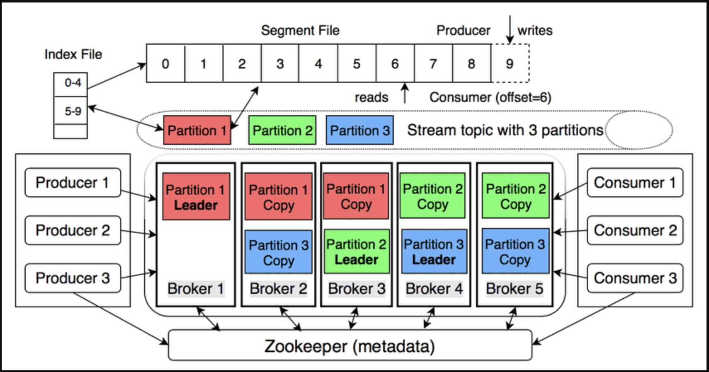

Kafka is described as a “distributed commit log” – a distributed system that stores an ordered stream of events, is replayable, and is highly fault-tolerant.

<!-- truncate -->

## 1. Overview of the architecture



| **Components** | **Main functions** |
| --- | --- |
| Broker | Kafka server stores and serves data. |
| Topic | Logical data stream; divided into Partitions. |
| Partition | An append-only log, with increasing offset – ensures order in partition. |
| Producer | Sends message (key-value) to topic; key determines partition (hash). |
| Consumer | Reads message by offset; no data is deleted. |
| Consumer Group | Consumer group divides partitions equally to scale horizontally. |
| Replication | Each partition has 1 leader and n followers; leader receives write, follower replicates to withstand errors. |
| Controller | Broker is elected as controller (replacing ZooKeeper in new version) to coordinate leader/follower. |

## 2. Working principle

a) Write data

- Producer sends record → Broker leader of partition → append to log.

- Message is flushed to disk according to configuration (default 7 days or when full).

- Replication is synchronous to follower (ack=all to ensure zero-loss).

b) Read data

- Consumer poll() continuously and commit offset (automatically or manually).

- Multiple consumer groups read the same topic independently – “replay” feature.

c) Guaranteed ordering

- Only in the same partition; if needed globally, use key or 1 partition.

## 3. Quick comparison with RabbitMQ

| Score | Kafka | RabbitMQ |
| --- | --- | --- |
| Model | Partitioned log | Queue |
| Ordering | In partition | In queue (single consumer) |
| Retention | Policy-based (days, GB) | Ack-based (delete when ack) |
| Scale | Horizontal (add broker) | Vertical (add queue) |
| Replay | Yes | No (acked, lost) |

## 4. Frequently asked questions about Apache Kafka

### What is the role of ZooKeeper in the Kafka system?

Zookeeper, as its name suggests (zookeeper), is the butler who manages the entire Kafka system. Here are some of the main roles of Zookeeper:

- Store cluster-wide metadata
  - List of live brokers
  - List of topics, partitions, replica assignments
  - ISR (In-Sync Replicas) of each partition
  - ACLs & quotas
  - Clients (producer/consumer) read this metadata through brokers; brokers get it from Zookeeper.
- Coordinate leader election
  - Each partition has 1 leader and n followers.
  - When the broker dies or the ISR changes, the broker controller (elected by Zookeeper) triggers. leader election → selects a new leader for the corresponding partition.
- Cluster configuration & change
  - When admin creates topic, changes replication-factor, ACL… changes are recorded in Zookeeper → controller updates and disseminates to broker.
- Do nothing
  - Do not save real data messages.
  - Do not participate in producer/consumer sending/receiving records.
- Zookeeper = “metadata brain & coordinator” of Kafka (in pre-KRaft version); it ensures cluster knows “who is alive, who is the leader, which topic is where” and automatically rebalances when there is a problem.

### What is Kafka Raft?

Kafka Raft – abbreviated as KRaft – is a consensus protocol developed by Apache Kafka to completely remove the dependency on ZooKeeper when managing cluster metadata. It was deployed from Kafka 3.3.1

KRaft turns Kafka into a “self-contained distributed streaming platform” – both storing data and managing metadata itself using Raft internally.

### ZooKeeper vs Kafka Raft comparison?

| **Criteria** | **ZooKeeper mode (pre-Kafka 2.8)** | **KRaft mode (Kafka ≥ 2.8, default from 4.0)** |
| --- | --- | --- |
| **Roles** | Metadata & leader-election system outside of Kafka | Metadata & controller integrated into Kafka via Raft consensus |
| **Number of systems required** | 2 (Kafka + ZooKeeper cluster) → 5–7 JVMs | 1 (Kafka-only) → only 1 JVM needed for dev/test |
| **Configuration** | `zookeeper.connect`, ACL ZooKeeper, SSL ZooKeeper… | `controller.quorum.voters`, `controller.listener.names` – no more ZK configs |
| **Metadata storage** | ZK znodes | Internal topic `__cluster_metadata` (event-sourcing, replayable) |
| **Limited number of partitions** | ~200 k (due to ZK bottlenecks) | >200 k (target millions) |
| **Partition creation/change time** | Linear, slow | Constant, fast (10×) – 42 s vs 600 s when reassigning 10 k partitions |
| **Fail-over controller** | 10–30 s (depends on ZK session timeout) | Almost instantaneous, ~1 s |
| **Security** | Must maintain 2 models: Kafka SASL/SSL + ZK ACL | Single, synchronous model |
| **Start dev/test** | Need to start ZK first | Run `kafka-server-start.sh` in one command |
| **Dynamic configuration** | Supports dynamic `advertised.listeners`, `leader.imbalance.*` | Restart required to change (static configuration) |
| **Migration path** | N/A | Required if upgrading to Kafka 4.0 – using `kafka-storage` tool & KIP-833 |

### In Kafka I have 3 topics, each topic I have 3 partitions, how many partitions will Kafka create?

Kafka will create a total of 9 partitions:

3 topics × 3 partitions/topic = 9 partitions.

### Is a Kafka partition a queue?

No. A Kafka partition is not a traditional queue (FIFO); it is an append-only log (commit log):

- Data is written sequentially to the end of the log file (incrementing offset).

- Consumers only read sequentially by offset; no data is deleted after reading.

- No pop(), poll(), peek() like queues; messages remain there until retention policy deletion (time/bytes).

### How do we know which offset the Consumer has consumed?

Consumers “remember” offsets by committing themselves (or letting Kafka commit for them) and saving offsets to the special topic __consumer_offsets:

- After batch processing is complete, call:

- `consumer.commitSync()` – blocks until broker ACKs.

- `consumer.commitAsync()` – does not block, has a callback.

- Or enable.auto.commit=true (default), Kafka automatically commits every [auto.commit.interval.ms](http://auto.commit.interval.ms/)
- Broker stores 3-tuple: ([group.id](http://group.id/), topic, partition) → offset in partition of __consumer_offsets
- When consumer restarts:
- Send OffsetFetch request to get last committed offset.
- Continue polling from that offset onwards (or follow auto.offset.reset policy if no offset yet).
- Consumer does not need to store offset on its side; offset is always centrally managed by Kafka.

### Is a kafka broker a server?

Yes — a Kafka broker is a physical or virtual server, running a JVM process (`kafka-server-start`).

However, it is possible to:

- 1 server running 1 broker (exactly 1:1).

- 1 server running multiple brokers if you want to test multi-broker on your personal machine (change port, log.dirs).

In actual production, 1 broker = 1 server to simplify operations and avoid I/O, port, resource conflicts.

### What is the structure of log file storage in Kafka?

```bash
<log.dirs>/ # broker configuration directory
├── topicA-0/ # partition 0 of topicA
│ ├── 00000000000000000000.log # message segment
│ ├── 0000000000000000000.index
│ ├── 0000000000000000000.timeindex
│ ├── leader-epoch-checkpoint
│ └── ...
├── topicA-1/ # partition 1 of topicA
├── topicA-2/ # partition 2 of topicA
├── topicB-0/ # partition 0 of topicB
...
```

- Real data is in .log file (binary).
- .index & .timeindex files help to search quickly by offset and timestamp (memory-mapped).
