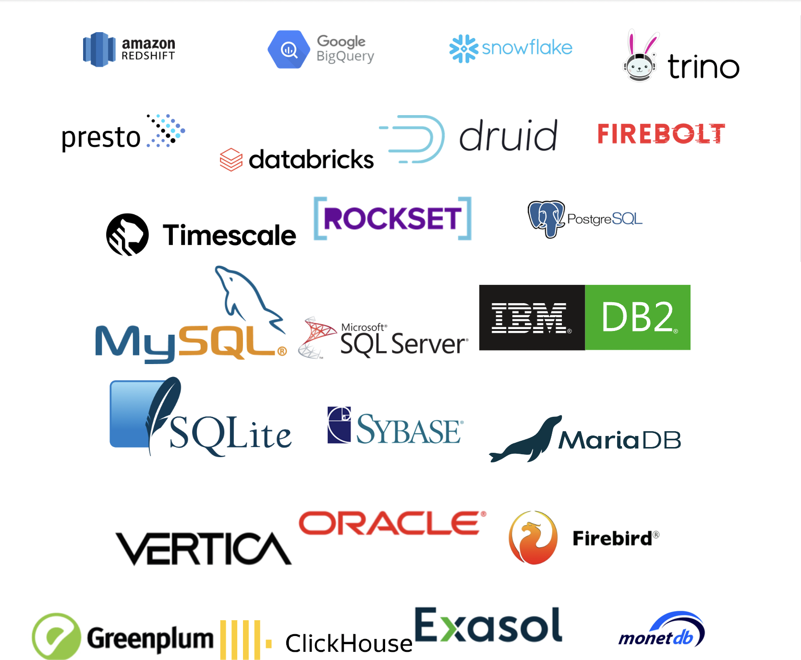

当做一个系统，或者一个应用程序的时候。除了操作问题之外，报表也是应用中非常重要且不可或缺的一部分。根据报告，管理层可以了解公司当前的经营状况，发现问题并及时提供解决方案，确保公司的利润。

<!-- truncate -->

报表可以有多种不同的类型，例如：表格、地图、图表等。开发此类报表需要您花费大量时间进行开发（后端和前端），这会导致大量的精力，并且可能会导致业务延迟。 。

Apache Superset 的诞生就是为了以更少的努力来处理这个报告任务，但仍然带来最大的效率。现在，让我们开始探索

## 1. 什么是 Apache 超集？

Apache Superset是AirBnB开发的一款高源码软件，旨在生动地可视化数据并有效地创建报告。

Superset 提供直观、易于使用、用户友好的用户界面。允许用户从各种数据源创建图表和地图

## 2. Apache Superset 的优缺点

### a.优势

* 开源：意味着您可以免费使用它，并且有一个始终贡献并提高产品质量的用户社区

* 易于使用：用户友好的界面，您无需成为数据专家即可使用它并仍然创建漂亮的仪表板和地图

* 类型多样的地图和图表：Superset为您提供大量免费地图和图表。但是，您绝对可以添加其他图表

* 支持多种数据源：Superset目前支持当今所有最流行的数据库类型，如Postgres、MySQL、...此外，对于尚不支持的数据库（如MongoDB），可以完全通过分布式查询引擎连接比如 Trino、Presto...

### b.缺点

除了我们上面提到的优点之外，Superset 还存在以下缺点：

* 复杂的安装和配置：对于初学者，或者不倾向于IT领域的人来说，安装和配置Superset会非常困难。

* 界面定制有限：Superset 在界面定制方面相当有限，只能通过提供的配置或每个 Dashboard 中嵌入的 CSS 来更改简单的界面。

* 缺乏官方支持：由于Superset是开源的，因此没有官方支持者，但如果遇到问题，用户将依赖社区的解决方法

## 3. 将 Apache Superset 与其他软件进行比较

与Apache Superset类似的软件有：

### a.Tableau

被认为是数据分析行业最强大的工具

它是商业软件，有版权，没有免费版本

该界面被认为易于使用、直观，并且不需要具有太多编程经验的人就能够创建各种类型的图表和报告。

具有良好的性能

### b.PowerBI

有一个免费版本，但它只涵盖基本功能。付费版本拥有更多高级功能

与微软生态系统良好集成

具有先进的分析功能，通过 Dart 语言提供良好的计算支持，并具有集成 Azure ML 机器学习模型的能力

易于使用和部署

### c. Metabase

与Superset类似，这是一个免费的开源软件

比 Superset 更易于使用，用户无需了解 SQL 即可创建图表和报告

Metabase 虽然易于使用，但功能比 Superset 少，并且不适合过于复杂的计算需求。

从下面的文章中，我们将学习如何安装Superset。