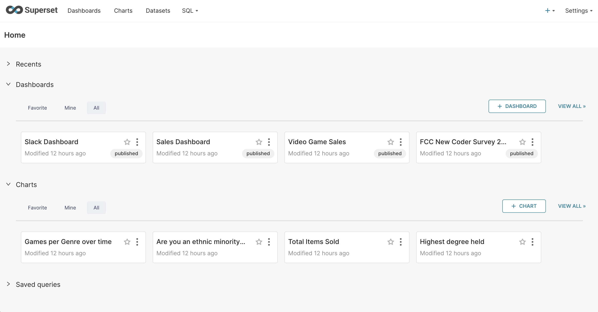

今天，我们将向您展示如何在个人计算机上安装Superset，以便您可以自由研究。

<!-- truncate -->

## 1. 准备

首先，为了能够安装 Superset，我们需要在 https://www.docker.com/ 下载并安装 Docker。这是一个用于部署、管理和操作容器化应用程序的开源平台。

当我们在 Docker 上运行 Superset 时，它将独立运行，无需在个人计算机上安装其他软件，例如 Python、Postgres、Redis、Node...


## 2.如何详细安装Apache Superset

### 步骤1：下载Apache Superset的源代码

您有2种方式下载Superset源代码：
- 方法1：使用git，运行命令`git clone --depth=1 https://github.com/apache/superset.git`，您将获得最新版本的Superset
- 方法二：直接从Github下载源码
 * 前往Superset的源代码网站：https://github.com/apache/superset/releases
 * 选择你要下载的版本，如图，我选择的是最新版本4.0.2
 * 您可以下载 zip 或 tar.gz 格式。然后，解压它


### 第 2 步：运行应用程序

解压后，我们会看到Superset文件夹中有一个docker-compose文件。有 2 个 docker-compose 文件：
- `docker-compose.yml`：用于开发环境的版本。您可以更改 Superset 的源代码，然后使用 docker-compose 命令运行它
- `docker-compose-non-dev.yml`：用于生产环境

运行它的简单方法是我们将使用 docker-compose 启动应用程序

```shell
docker-compose -f docker-compose-non-dev.yml up -d
```


## 3.安装包中的组件

安装完成后，您将在 Docker Dashboard 屏幕上看到以下组件：


- superset_app：这是Superset的主要组件，包括Backend和Frontend
- superser_cache：用于缓存 Apache Superset 上的信息，有助于提高访问报告时的速度。缓存使用Redis
- superser_db：用于存储Superset的必要信息（元数据），例如：仪表板，图表，用户权限，...此数据库使用Postgres
- superset_worker：用于运行异步查询、快照报告、发送电子邮件等任务
- superset_worker_beat：执行额外的调度程序并与工作人员交互以完成某些任务。这些组件正在使用 Celery

## 4. 访问 Superset 网站

Superset的组件运行完毕后，访问http://localhost:8088打开Superset，使用Superset的默认账户登录：
- 用户名：管理员
- 密码：管理员


这样您就完成了 Superset 的安装

