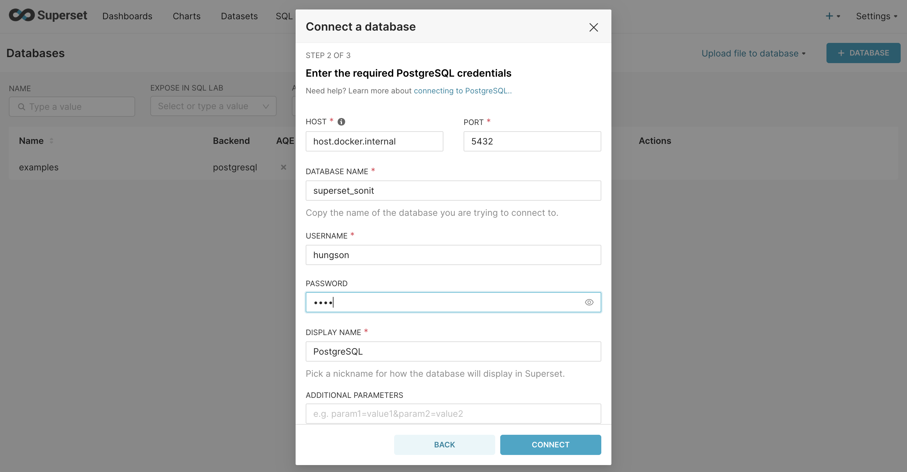

在上一篇文章中，我[向您展示了如何安装 Apache Superset](/2024-10-01-cai-dat-superset)。安装完成后，我们首先要考虑的是如何使用Superset制作仪表板和报表。在本文中，我将逐步指导您创建报告，并配有插图

<!-- truncate -->

## 1.流程总结

为了能够使用 Superset 制作仪表板，先决条件是您需要有一个数据源，这意味着您将从哪里获取数据来制作报告。正如我在文章[Superset简介](/2024-09-30-tim-hieu-ve-apache-superset)中分享的那样，目前Superset可以支持许多不同的数据源，例如Postgres、MySQL、Clickhouse、Microsoft SQL Server , ...

确定数据源后，您需要将 Superset 连接到您的数据源

接下来，需要根据该数据源在 Superset 上创建数据集。 Superset 上的报告不能直接使用您的数据源，而是通过数据集工作

从这些数据集中，我们可以创建图表。将 1 个或多个图表排列在一个屏幕上，该屏幕称为仪表板

现在让我们开始完成每个步骤

## 2. 将 Superset 连接到数据源

正如我在第 1 部分中提到的，我们需要的第一件事是连接到我们想要制作报告的数据源。要连接到数据源，我们按照以下步骤操作：

步骤1：使用具有管理员权限的帐户，点击屏幕右上角的设置菜单->选择数据库连接

步骤2：根据您的数据库源选择数据库类型。例如这里我会选择Postgres

步骤 3：填写所有必要的信息，例如主机、端口、数据库名称、用户、密码，以连接到需要获取报告数据的数据库。

步骤4：连接成功后，您将进入最后的配置屏幕，这里我最感兴趣的是SQL Lab部分。在这里，您可以授予额外的权限以通过 SQl Lab 与您的数据库进行交互

成功连接数据库后，您将在列表中看到您的数据库

至此，数据源连接成功。