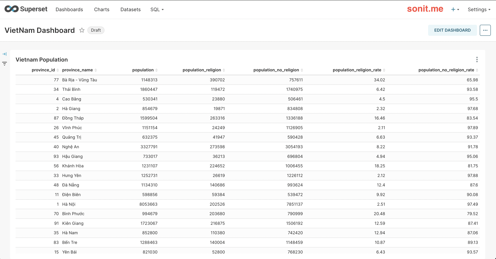
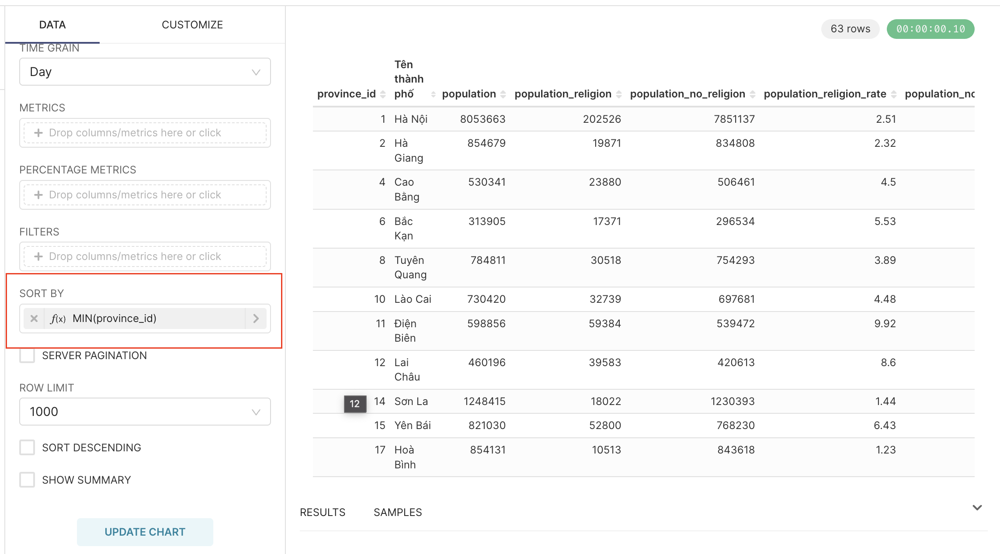
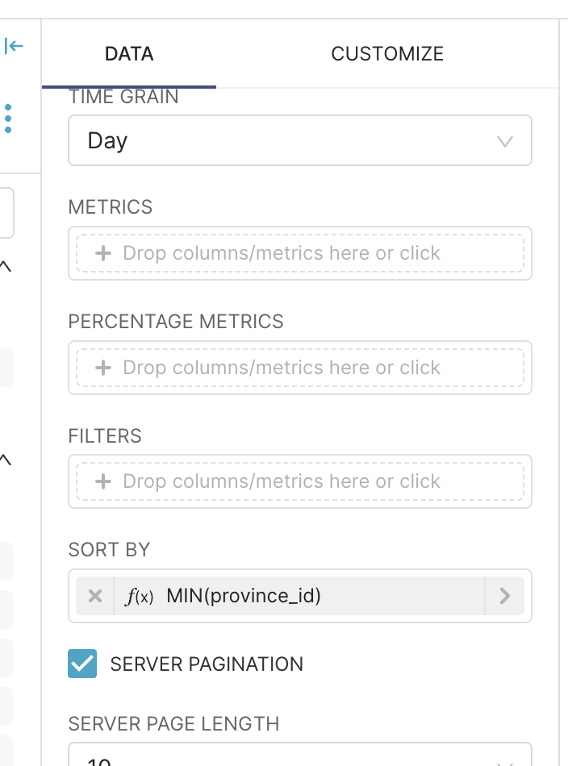

表格图表是制作报告时最流行和最简单的图表类型之一。这些图表的目的是帮助观众观察每个标准的具体数字？您可以按特定顺序查看它们，或者最简单地按数据集中的列列出它们。

<!-- truncate -->

## 1. 表格图表的类型（Table Chart）

当你进入Superset的图表菜单，选择图表类型Table时，你会看到Superset有3种类型可供我们选择，分别是：表格、数据透视表、时间序列表。根据给定问题的具体需求，您将选择适当的图表类型。

下面，我将针对每种类型进行详细说明

## 2.创建表格图表（Table）

### a.介绍

表格图表是一种简单的图表，以类似于 Excel 的水平行和列显示

用途：用来显示你的数据的详细信息，比如交易列表，订单列表，员工列表，学生列表，...这种类型的图表你可以在很多地方看到，只要有数据的地方，你就可以找到这种类型的图表。

### b.如何创建表格图表

创建图表的过程，我在文章【如何使用Superset制作简单的报告】(/2024-10-09-cach-lam-report-don-giant-bang-apache-superset-phan -2 ）。创建表格图表非常简单，您只需选择要在图表上显示的列，然后单击“更新图表”，然后您就可以在右侧看到结果。

## 3. 创建数据透视图（Pivot Table）

### a.介绍

数据透视表是一种图表形式，它将相似的条件分组，并可以根据这些条件计算数字。

目的：帮助根据查看者想要的标准快速查看统计数据。

例如：如上图，我想对哪些省份人口>500万，哪些城市人口<500万进行分组。

### b.如何创建表格图表

第 1 步：您需要选择图表类型为数据透视表

第 2 步：数据透视表需要您有 2 个部分：
* 1.维度（即要按什么条件分组），有2种：Row（按行查看）和Column（按列查看）
* 2. 指标（您想要对维度使用什么计算），例如 Sum、Average、Min、Max、...

## 4. 创建时间序列图表（Time-series Table）

### a.介绍

时间序列表是一种图表形式，用于查看数据随时间变化的趋势。例如，在一周内，我想看看我的业务成果是逐日增加还是减少，所以我可以使用这个图表。

该图表可帮助用户了解趋势

:::warning

注意：为了能够构建时间序列图表，您的数据集必须有一列来确定我们需要查看趋势的时间。例如：创建日期、更新日期……

:::

### b.如何创建时间序列图表

步骤1：您需要选择图表类型为时间序列表，并选择制作报告所需的数据集

步骤2：在时间序列表上会有以下一些属性：
- 时间列：选择数据集中具有时间戳数据类型的列
- 时间粒度：选择您想要查看趋势的时间级别（按天、按周、按月...）
- 指标：选择您想要查看数据的方式
- 时间序列列：选择您要查看的类型（数字、线条……）

## 5. 使用表格图表时的一些技巧

### a.如何重命名列

通常情况下，Superset会以Dataset中的列名作为报表的列名。这对用户来说并不友好，而且很可能会让用户感到困惑。

要重命名列，请执行以下步骤：
- 第 1 步：单击要重命名的列
- 第 2 步：选择`CUSTOM SQL`选项卡
- 第 3 步：单击标题上的笔
- 第 4 步：根据需要重命名
- 第 5 步：单击“保存”

### b.过滤显示的数据

- 几乎所有图表都提供此数据过滤部分
- 目的是过滤掉想要在图表上显示的数据。例如：您有一个包含越南所有省份和城市的数据集。如果你想制作一个只显示南方数据的图表，这是一个有效的选择
- 您只需选择要显示的列和条件即可使用它。或者，您可以在`CUSTOM SQL`选项卡中编写查询来创建更复杂的过滤器，或将多个条件组合在一起。

### c。按条件对数据进行排序

- 您选择要对“SORT_BY”属性进行排序的列
- 在下面，您将看到“SORT_DESCENDING”复选框。如果勾选并勾选此框，您的数据将从高到低排列，否则从低到高排列

### d。添加数据搜索框

- 适用于原始表格图表（按行和列）
- 用于在表中搜索关键字
- 单击“CUSTOMIZE”选项卡，勾选“SEARCH_BOX”框。这样我们就可以在Table中查找数据了

### e.分页

- 也适用于原始表
- 当您需要显示的数据量有很多行时，此分页是必要的
- 单击“CUSTOMIZE_”选项卡，在“PAGE_LENGTH”部分右侧，选择要在 1 页中显示的行数，然后 Superset 将自动显示页码

- 但是，这只是一种前端方法，如果您有很多数据流，则完全不是性能最佳的。因此，Superset 允许您通过勾选“SERVER_PAGINATION”复选框从后端（服务器）分页

### f。重新格式化字母和数字

- 默认情况下，Superset 将显示所有数字，或按照默认格式显示数字、日期、月份、年份格式。我们可以根据需要更改格式
- 单击“CUSTOMIZE_”，选择要更改格式的列 -> 出现弹出窗口，选择“NUMBER_FORMATTING”选项卡
- Superset 使用 D3 格式 (https://github.com/d3/d3-format)。如果Superset格式不在列表中，完全可以直接按照D3输入格式

- 要格式化日、月和年，请在属性“TIMESTAMP_FORMAT”中选择所需的显示格式

)