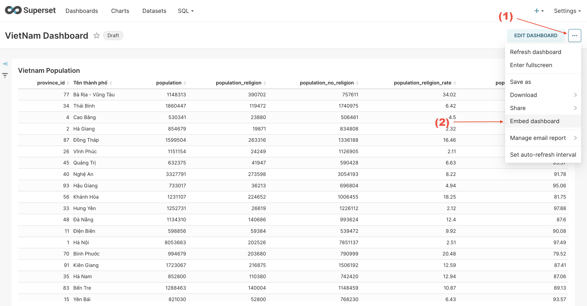
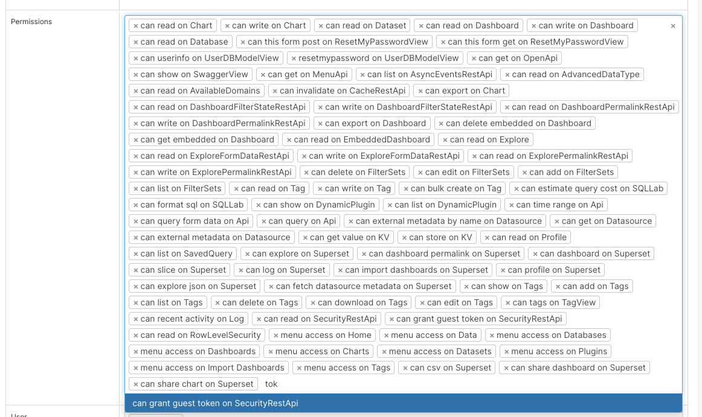

Apache Superset 的一个好处是您可以将完成的仪表板嵌入到您的任何网站中。这确实是一件好事，因为我们可以快速制作报告，而无需花费太多时间和资源来构建后端和前端。

<!-- truncate -->

为了能够将 Superset 嵌入到我们的网站中，我们需要将您的后端和前端与 Superset 集成。现在让我们开始学习如何将 Apache Superset 仪表板嵌入到您的网站中。

## 1. 如何在 Superset 上获取仪表板的 UUID

### a.设置环境变量

- 首先，为了能够启用允许将 Superset Dashboard 嵌入到任何网站的功能，我们需要设置 Superset 的环境变量

- 如果使用 Docker 进行部署，请打开文件“docker/pythonpath_dev/superset_config.py”，找到“FEATURE_FLAGS”行，并将变量“EMBEDDED_SUPERSET”添加到配置中，值为 True


请记住，配置完成后，您需要重新启动容器才能接收环境变量

### b.如何获取UUID

每个仪表板都有自己的密钥，根据 UUID 格式进行格式化。要将其嵌入到网站上，Superset 需要知道您要嵌入哪个仪表板，因此您需要获取要嵌入的仪表板的 UUID。

打开配置 `EMBEDDED_SUPERSET=True` 后，执行以下步骤获取 UUID：
- 第1步：打开您要嵌入的仪表板
- 第2步：点击右上角的三点按钮，然后选择“嵌入仪表板”



- 第 3 步：出现一个小弹出窗口，按“启用嵌入”按钮


- 步骤4：您将看到该仪表板的UUID，这是仪表板集成到网站的关键。您需要记下此键才能执行后续步骤


## 2. 后端

### a.使命

- 与Apache Superset API直接集成，包括：身份验证、授权、获取Guest Token以提供Superset中嵌入的FE

- 与后端Superset集成将确保安全性，避免泄露用户名和密码等敏感信息

### b.与 Apache Superset 集成的步骤

**第一步：调用登录API获取访问令牌**

```shell
curl --location '{{superset_domain}}/api/v1/security/login' \
--header 'Content-Type: application/json' \
--data '{
  "password": "{{user_login}}",
  "provider": "db",
  "refresh": false,
  "username": "{{password_login}}"
}'
```

:::warning
- user_login / password_login：登录 Superset 的帐户。此帐户必须具有**可以在 SecurityRestApi 上授予访客令牌**权限

- superset_domain：superset网站的域名
:::

**第二步：调用API获取csrf token**

```shell
curl --location '{{superset_domain}}/api/v1/security/csrf_token/' \
--header 'Authorization: Bearer {{access_token}}'
```

:::warning
- access_token：取自步骤1中登录API返回的结果
:::

**步骤3：调用API获取访客令牌**

```shell
curl --location '{{superset_domain}}/api/v1/security/guest_token/' \
--header 'X-Csrftoken: {{csrf_token}}' \
--header 'Authorization: Bearer {{access_token}}' \
--header 'Content-Type: application/json' \
--data '{
    "resources": [
        {
            "id": "{{dashboard_uuid}}",
            "type": "dashboard"
        }
    ],
    "user": {
        "username": "{{user_login}}"
    },
    "rls": [{
        "clause": "team_id IN (1)"
    }]
}'
```

:::warning
- access_token：取自步骤1中登录API返回的结果
- csrf_token：取自步骤2中登录API返回的结果
- dashboard_uuid：仪表板uuid取自第[1]节
:::

:::warning
rls (Row Level Security)：通常用于根据 Dataset 中的行级别分散数据。如上例，我只获取ID = 1的团队的数据
:::

## 3. 前端

### a.使命

- 在后端获取访客令牌后，接下来我们需要如何在网站上显示 Superset 的仪表板。

- Apache Superset为我们提供了React JS的SDK库，因此我们可以轻松地将我们的仪表板放在网站上

### b.实施步骤

**第 1 步：安装 Superset Embed SDK**

```shell
npm install --save @superset-ui/embedded-sdk
```

**第2步：将SDK嵌入到您想要显示仪表板的网站**

```js
import { useEffect } from "react";

import DashboardLayout from "examples/LayoutContainers/DashboardLayout";

// Import Superset SDK
import { embedDashboard } from "@superset-ui/embedded-sdk";

// Function này gọi API tới Backend để lấy Guest Token
const getToken = async () => 'eyJ0e...';

function Superset() {
    useEffect(() => {
        const embed = async () => {
            embedDashboard({
                id: "{{dashboard_uuid}}", 
                supersetDomain: "{{superset_domain}}",
                mountPoint: document.getElementById("superset_dashboard"), 
                fetchGuestToken: () => getToken(),
                iframeSandboxExtras: ['allow-top-navigation', 'allow-popups-to-escape-sandbox']
            });

            const iframe = document.getElementById('superset_dashboard')?.querySelector('iframe')

            if (iframe) {
                iframe.style.width = '100%'
                iframe.style.height = '800px'
            }
        }

        if (document.getElementById('superset_dashboard')) {
            embed()
        }
    }, [])

    return (
        <DashboardLayout>
            <div id="superset_dashboard" />
        </DashboardLayout>
    )
}

export default Superset;
```

最后，让我们看看结果


