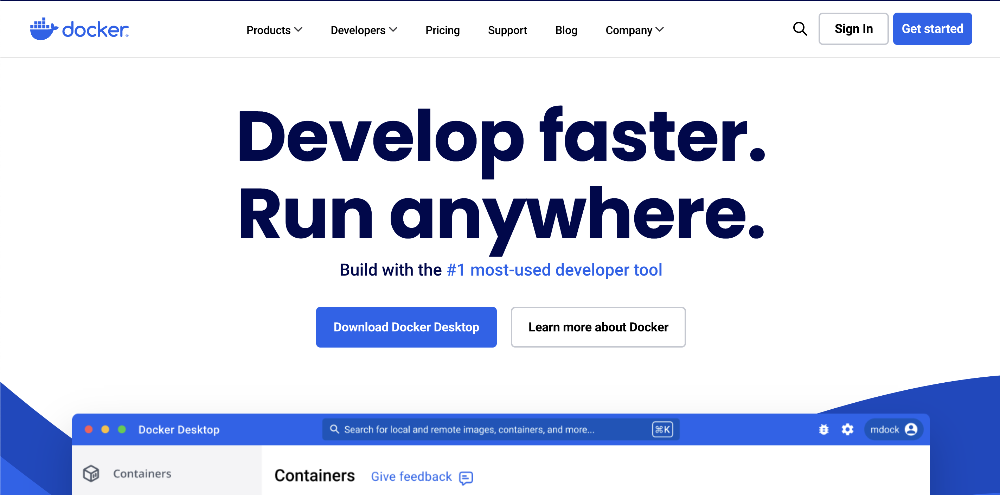
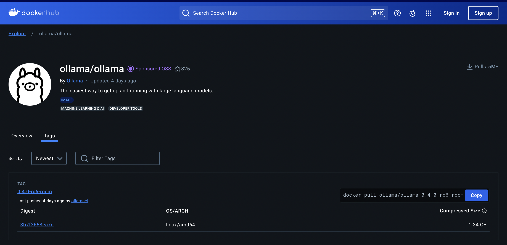
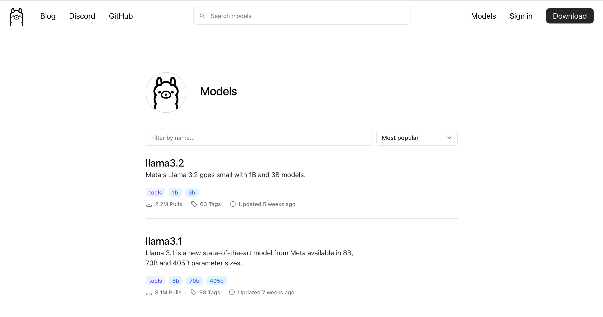
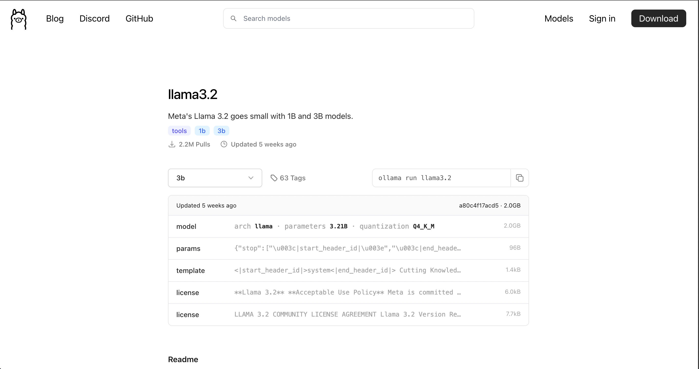
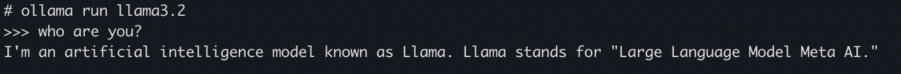

如今，我们可以很容易地访问人工智能聊天应用程序，最著名的是OpenAI的ChatGPT、谷歌的Gemini、微软的Copilot……这些软件对于普通用户来说几乎是免费使用的，除非你想使用。更高级的功能，则需要付费升级。

不过，如果你想尝试在个人电脑上构建自己的私人助理，并想自由选择型号，那么请看下面的文章，我会给出详细的说明。

<!-- truncate -->

## 1.简介


以前，在个人计算机上安装一般的AI模型，特别是LLM模型是一件非常困难的事情。它们对计算机配置要求非常高，并且要经历非常复杂的安装过程。如果你的电脑只使用CPU而不外接显卡，那就极其困难了

然而，近年来，以ChatGPT为首的许多大型语言模型（LLM）的出现，让每个人都有机会接近AI，包括普通人或从事与计算机科学无关的其他领域的人。领域，仍然可以使用AI。接下来，怀着掌握自己技术的愿望，程序员社区以及大型组织纷纷推出了很多大型的开源语言模型（Open Source），比如 Google 的 Gamma（这里可以认为是 Gemini 的一部分）、Meta 的 Llama 以及数十个其他开源模型，可以帮助任何人构建自己的LLM系统，或者简称为自己的Chatbot系统。


在今天的文章中，SonIT.me将指导您如何使用[Olama](https://ollama.com/)在个人电脑上构建LLM系统。 Olama是一款用于在个人计算机上轻松管理和运行AI模型的工具，并且可以部署到物理服务器。

## 2.安装Docker

在计算机上安装 Ollama 的方法有很多种，但最简单的方法是安装在 [Docker](https://www.docker.com/) 上。



这里我不详细说明如何安装Docker，您可以根据您使用的操作系统参考这里的安装说明。

https://docs.docker.com/desktop/install/mac-install/

## 3.安装Ollama

安装完 Docker 后，我们接下来要做的就是在 Docker Registry 官方上找到 Ollama 的 Docker 镜像。

前往 Ollama 在 Docker Hub 上的官方页面（[点击这里](https://hub.docker.com/r/ollama/ollama/tags)，找到最新版本。在撰写本文时，新版本是 Ollama 最好的版本）是 0.3.14



接下来，使用以下命令下载 docker 镜像并运行它。如果您仅使用 CPU 进行处理，则运行此命令

```shell
docker run -d -v ~/ollama:/root/.ollama -p 11434:11434 --name ollama ollama/ollama:0.3.14
```

如果您的计算机具有 Nvidia GPU 外部显卡，请运行以下命令以利用显卡的功能。

```shell
docker run -d --gpus=all -v ~/ollama:/root/.ollama -p 11434:11434 --name ollama ollama/ollama:0.3.14
```

:::warning
- 您需要安装“/root/.ollama”文件夹及其他文件夹，因为模型将被下载并保存在该文件夹中。如果不挂载该文件夹，则每次再次运行 docker run 命令时，都需要重新下载模型。这是相当耗时的，因为LLM模型的容量非常大，从几GB到几十GB不等
- 端口 11434 是应用程序可以通过 Rest API 与 Ollame 通信的端口
:::

## 4. 在Ollama上安装模型

Ollama本质上是一个运行LLM模型的支持工具，完成上述步骤的安装后，我们仍然不能将其用作普通的聊天机器人，而是需要在Ollama上安装一个额外的模型。

首先，前往 Ollama 的库页面 (https://ollama.com/library) 查找适合您计算机的型号。



单击相应的型号，您将看到任何型号的安装说明及其版本。如下图，我选择了llama3.2模型，你会看到安装该模型的方式是`ollama run llama3.2`



为了安装模型，我们需要访问docker容器来运行，然后运行上面的命令：
```shell
docker exec -it ollama /bin/sh
ollama run llama3.2
```

安装完成后，您将看到如下终端屏幕

```shell
# ollama run llama3.2
>>> Send a message (/? for help)
```

现在，尝试提出一个问题，看看您的 BOT 将如何回答？



OK，这样就安装成功了。在接下来的文章中，我将指导您围绕 Ollama 构建系统和应用程序。