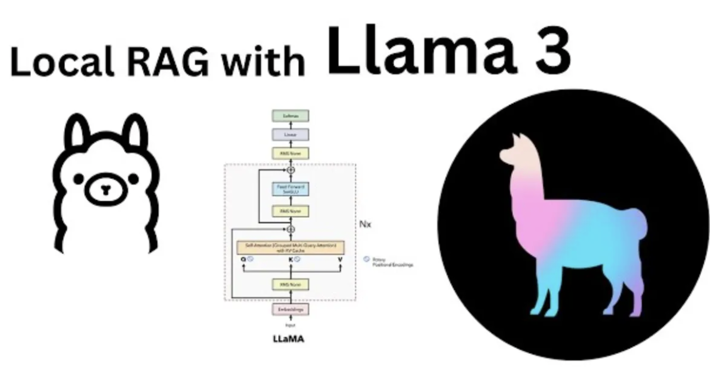
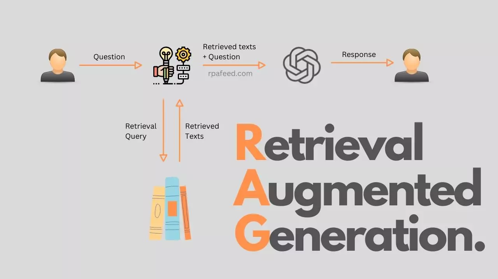

在上一篇文章中，我指导了您[如何在个人计算机上安装 Ollama](/2024-11-01-how-to-install-large-language-model-locally)，并且还指导了您如何在 Ollama 上安装模型？继续与大型语言模型和 Ollama 相关的系列文章，今天我将指导您如何构建一个简单的 RAG 服务器，并与 Ollama 集成。

<!-- truncate -->

## 1.什么是RAG服务器？

检索增强生成 (RAG) 是自然语言处理 (NLP) 中的一种方法，它结合了两个主要组件：
- 检索：首先，RAG 系统将从大型数据集或知识库中搜索和检索信息。这有助于它检索相关信息来回答问题或提供背景信息。
- 生成：一旦检索信息可用，系统就会使用语言模型来生成响应。它将把检索到的信息与其自然语言生成能力相结合，以生成合理且适合上下文的响应。

## 2. 使用 RAG 服务器的好处

与使用普通模型相比，RAG服务器具有以下优势：

- 提高准确性：由于 RAG 依赖于您的数据，因此 RAG 给出的答案更加准确。
- 快速数据更新：RAG 将直接访问您的数据库，更快地更新新数据，而无需重新训练模型以使 AI 能够理解您的数据（这会花费大量资源和时间）。
- 提供给客户的信息更准确：RAG将依靠您的数据来回应客户，因此AI提供给客户的信息更准确。

## 3. RAG 的应用

利用 RAG 的上述优势，您可以做到：
- 聊天机器人：这是我们首先会想到的，一个可以随时随地提供产品咨询、照顾客户的聊天机器人。
- 更好的搜索支持：因为它只提取您自己的数据，所以搜索会更准确
- 需要持续更新数据的应用程序：例如医疗保健、教育、财务分析和市场。数据会不断更新，因此应用程序也必须快速更新才能给出最准确的答案。

## 4. 使用 Golang、Langchain 和 Ollama 构建一个简单的 RAG 服务器

如上模型，RAG服务器会同时连接LLM（用于自然语言处理）和包含您自己数据的向量数据库。在本文中，我将提供如何获取简单数据（不使用数据库）的基本说明，以便您了解 RAG 服务器的工作原理。

