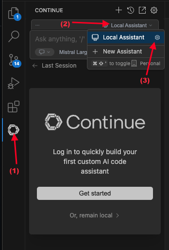
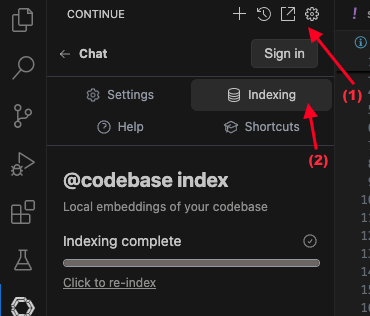

如今，利用AI助手辅助编程，让开发者的工作变得更加轻松高效。不过 Github 产品 Copilot、Tabnine、Cursor AI…… 都是付费产品，而且这些产品的费用不低，尤其是对于学生和刚开始工作的人来说。因此，在本文中，我将分享如何免费使用 AI 助手来支持您的编码。

<!-- truncate -->

## 1. AI助手简介


IDE 中的 AI 助手是一种人工智能 (AI) 集成工具，旨在协助和提高开发人员在编码、调试、理解代码和执行与软件开发相关的任务时的表现。

如今市面上已经出现了不少自主研发的AI助手，其中比较出名的有Github Copilot、Cursor AI、Tabnine……但是这些工具都是需要付费的，或者免费版的功能非常有限。

今天，我将指导您如何在 VSCode、IntelliJ IDEA 等 IDE 上免费安装和使用 AI Assistant……

## 2. AI助手主要功能


AI助手通常具备以下基本功能：
- 直接集成到IDE：为了让AI助手了解您的代码，您正在进行的项目，...它需要直接集成到IDE中，帮助您更快，更高效地编写代码。
- 智能代码完成：AI 助手将根据项目内容自动建议下一行代码，或建议函数、变量等，帮助您更快地编写代码
- 代码建议：更好的编码建议、流行的设计模式
- 代码分析和错误检测：使用 AI 模型分析代码，检测潜在的错误、安全漏洞、性能问题并提出修复建议。
- 解答代码相关问题：在开发中的项目中提出代码相关问题，直接在IDE中获得答案。

## 3. 注册一个免费的 Mistral 账户

[Mistral AI](https://mistral.ai/) 是一个提供人工智能相关产品的平台，隶属于法国公司 Mistral。

Mistral 有一个专门用于编写代码的模型，称为 [Codestral](https://mistral.ai/news/codestral)。这是一个专门为代码生成、代码建议和代码改进任务设计和优化的生成模型。 Codestral 经过了 80 多种编程语言的训练，因此它在流行和不太流行的语言上都能表现良好。

您现在可以在 Mistral 平台上直接免费使用 Codestral。您需要执行以下步骤：

- 1.前往https://console.mistral.ai/注册账号，或者使用其他社交网络账号如Google、Microsoft、Apple登录。

- 2.登录成功后，进入API Keys菜单，创建另一个API。此键用于调用 Mistral API 直接在您的 IDE 上提出和回答问题。


- 3. 接下来，进入Codestral菜单创建API密钥。此 API 密钥用于直接与 IDE 集成，自动生成代码并为您建议代码。


请记住保存这 2 个密钥，以便我可以继续执行步骤 4。

## 4. 如何安装AI助手扩展（续）

要与 Mistral 的 API 集成，您需要在 VSCode 和 IntelliJ IDEA 上安装 AI Assistant（Continue）扩展。 https://www.continue.dev/。

###一个。在 VSCode 上安装 Continue

进入 VSCode 的扩展菜单，搜索“继续”并安装


安装成功后，左侧菜单上会出现继续图标。单击该图标，然后按照下图中的步骤打开 config.json 文件。



在config.json文件中，需要编辑以下位置：

```json
"models": [{//配置与AI聊天的模型
    "title": "Mistral Large", // 设置模型的显示名称
    "provider": "mistral", // 默认为 mistral
    "model": "mistral-large-latest", // 模型名称，了解更多信息 https://docs.mistral.ai/getting-started/models/models_overview/
    "apiKey": "xxx" //步骤3.2中注册的API密钥
}],
"tabAutocompleteModel": { // 配置代码建议模型
    "title": "Codestral", // 设置模型的显示名称
    "provider": "mistral", // 默认为 mistral
    "model": "codestral-latest", // 代码提示的模型名称，名称为 codestral
    "apiKey": "xxx" //步骤3.3中注册的API密钥
}，
"embeddingsProvider": { // 发送消息时自动建议的配置模型
    "provider": "mistral", // 默认为 mistral
    "model": "mistral-embed", // 发送消息时自动建议的模型名称，名称为 mistral-embed
    "apiKey": "xxx", //步骤3.2中注册的API密钥
    "apiBase": "https://api.mistral.ai/v1" // API 链接
}
```

安装完成后，保存文件即可完成。

### b.在 IntelliJ IDEA 上继续安装

转到菜单设置 -> 插件 -> 市场 -> 搜索继续 -> 安装


安装完成后，IDE 左侧将出现“继续”菜单。然后，您可以像VSCode上的安装步骤一样配置模型。


:::tip

如果您同时使用 VSCode 和 IntelliJ，则只需在两个 IDE 中的一个中设置配置。因为 Continue 会读取项目根文件夹中的 `.continue` 文件夹中的配置。(`~/.continue/config.json`)

:::

## 5. 如何使用

为了让 AI 理解您的项目并更好地支持您，您需要对您的代码进行索引。点击设置图标 -> 索引



然后，在编码过程中，AI将帮助您建议代码。


此外，您还可以直接聊天询问代码，以及支持修复错误、寻找解决方案和代码审查。


因此，我已经在我的 IDE 上完成了 AI 助手的安装和配置。除了 Mistral，Continue 还支持许多其他提供商，例如：Ollama、OpenAI、Claude、Gemini……您可以了解更多信息，以选择适合您的要求和预算的模型。