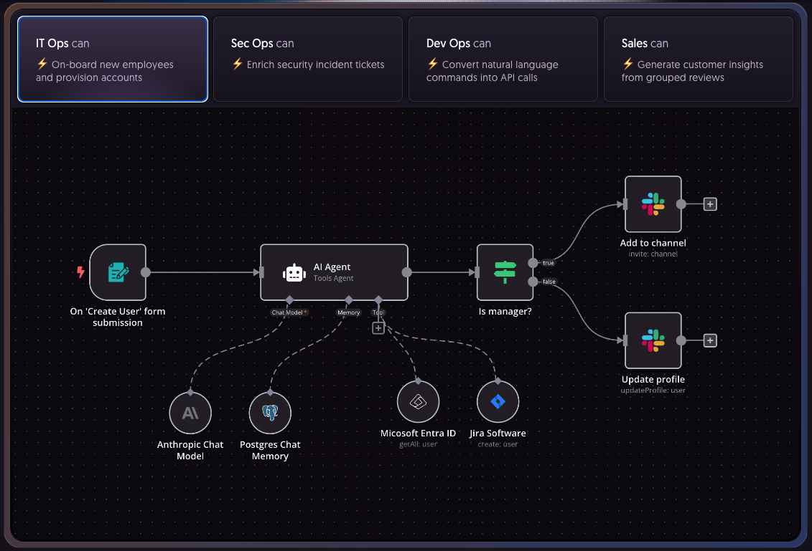
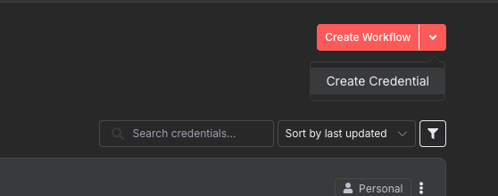
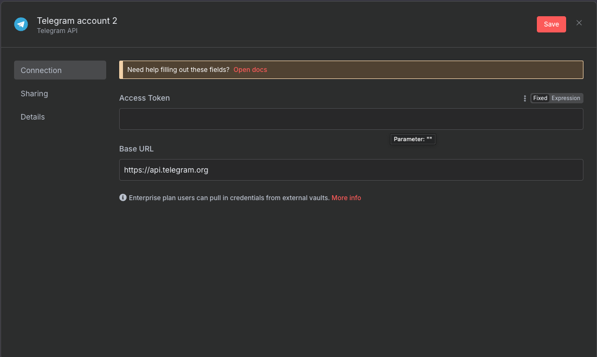

传统上，当将新服务与您的系统集成时，您需要编写代码来集成它。您将需要检查 API 文档、编写代码、测试和部署。这需要花费大量的时间和精力。

随着无代码/低代码系统的发展，您可以使用用户界面将新服务与您的系统集成，而无需编写太多代码。 n8n 就是为了解决这个问题而诞生的。那么 n8n 是什么？它是您可以在系统中利用的强大工具吗？让我们开始吧。

<!-- truncate -->

## 1.什么是N8n？

N8n 是一个开源工作流自动化工具，允许用户连接和集成各种应用程序、服务和工具来创建自动化工作流。

N8n 使用 Node.js 开发，并提供直观的用户界面来设计和管理工作流程。它支持多种连接类型，包括 HTTP、API、数据库、电子邮件等。

N8n 是一款开源软件，您可以使用付费版本（在云端使用）或安装在您的计算机上（自托管）。



## 2. n8n 安装说明

安装 n8n 有两种流行的方法，即通过 npm 直接安装和通过 Docker 安装。

### 2.1。通过 npm 安装 n8n

- n8n 要求您的机器安装 Node.js 18 或更高版本。

- 然后，打开终端，输入命令：

  ```sh
  npm install n8n -g
  ```

- 要安装特定版本，可以使用以下命令：

  ```sh
  npm install -g n8n@0.126.1
  ```

- 安装完成后，您可以使用以下命令启动 n8n：

  ```sh
  n8n
  # or
  n8n start
  ```

### 2.2。通过 Docker 安装 n8n

- 首先，您需要创建一个 docker 卷来包含数据。

  ```sh
  docker volume create n8n_data
  ```

- 接下来，使用 docker run 命令启动 n8n

  ```sh
  docker run -it --rm --name n8n -p 5678:5678 -v n8n_data:/home/node/.n8n docker.n8n.io/n8nio/n8n
  ```

- 运行上述命令时，默认情况下 n8n 将使用 SQLite 来存储数据。如果要使用 PostgreSQL，请运行以下命令：

  ```sh
  docker run -it --rm \
  --name n8n \
  -p 5678:5678 \
  -e DB_TYPE=postgresdb \
  -e DB_POSTGRESDB_DATABASE=<POSTGRES_DATABASE> \
  -e DB_POSTGRESDB_HOST=<POSTGRES_HOST> \
  -e DB_POSTGRESDB_PORT=<POSTGRES_PORT> \
  -e DB_POSTGRESDB_USER=<POSTGRES_USER> \
  -e DB_POSTGRESDB_SCHEMA=<POSTGRES_SCHEMA> \
  -e DB_POSTGRESDB_PASSWORD=<POSTGRES_PASSWORD> \
  -v n8n_data:/home/node/.n8n \
  docker.n8n.io/n8nio/n8n
  ```

- 启动成功后，打开浏览器访问地址即可访问n8n `http://localhost:5678`

## 3. 在 n8n 上构建简单的工作流程

在今天的帖子中，我将指导您根据以下模型在 n8n 上构建一个简单的工作流程：

### 3.1 工作流设计


**工作流程描述**
- [1] 用户将音频片段（或录音文件）上传到 Telegram
- [2] 系统会验证上传到 Telegram 的音频文件是否有效？在这里我将验证文件大小和文件格式。
- [3] 如果文件有效，Telegram 将下载该文件并将其保存到本地文件夹
- [4] 成功下载文件后，OpenAI 会将音频文件转换为文本
- [5] 转换为文本后，我使用 Mistral AI 对用户输入的音频进行总结。
- [6] 最后，我会将汇总结果通过Telegram发回给用户

### 3.2 详细分步说明

查看图表，我们发现将有 3 个主要组件：Telegram、OpenAI 和 Mistral AI。对于每个组件，我们需要为每个组件设置凭据。

- 在屏幕右上角，单击下拉箭头并选择创建凭证



- 打开一个对话框，选择要配置的类型，如图所示，我选择 Telegram。


- 接下来，根据您要配置的组件类型，您将输入必要的信息。例如，对于 Telegram 来说它是 BOT API Token，对于 OpenAI 来说它是 API Token...



配置完凭证后，点击创建工作流，按照自己的意愿创建工作流。 N8n 将提供多种可用的组件。

## 4. 结论

N8n 的诞生是为了支持许多组织和企业在构建服务其业务的工作流程时节省时间和精力。对于您可以处理的任务，您应该使用它来尽量减少精力和时间。


