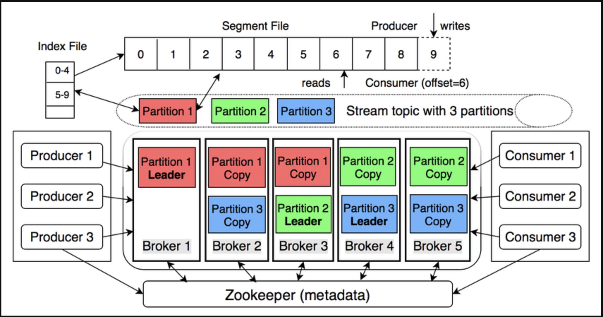

Kafka 被描述为“分布式提交日志”——一个存储有序事件流、可重放且高度容错的分布式系统。

## 1. 架构概述

| **组件** | **主要功能** |
| --- | --- |
| Broker | Kafka 服务器存储和服务数据。|
| Topic | 逻辑数据流；划分为多个分区。|
| 分区 |仅追加日志，偏移量递增，确保分区有序。|
| 生产者 | 向主题发送消息（键值对）；键决定分区（哈希）。|
| 消费者 | 根据偏移量读取消息；不删除任何数据。|
| 消费者组 | 消费者组将分区均等划分，实现水平扩展。|
| 复制 | 每个分区有 1 个领导者和 n 个追随者；领导者接收写入操作，追随者进行复制以应对错误。|
| 控制器 | Broker 被选举为控制器（在新版本中取代 ZooKeeper），以协调领导者/追随者。|

## 2. 工作原理

a) 写入数据

- 生产者发送记录 → Broker 分区的 Leader → 追加到日志。

- 消息根据配置刷新到磁盘（默认 7 天或写满时）。

- 复制同步到跟随者（ack=all 以确保零丢失）。

b) 读取数据

- 消费者持续 poll() 并提交偏移量（自动或手动）。

- 多个消费者组独立读取同一主题 - “重放”功能。

c) 保证顺序

- 仅在同一分区内；如果需要全局访问，请使用键或单个分区。

## 3. 与 RabbitMQ 快速比较

| 得分 | Kafka | RabbitMQ |
| --- | --- | --- |
| 模型 | 分区日志 | 队列 |
| 排序 | 分区内 | 队列内（单个消费者）|
| 保留 | 基于策略（天数，GB）| 基于确认（确认后删除）|
|规模 | 水平（添加代理）| 垂直（添加队列）| | 重放 | 是 | 否（确认，丢失）|

## 4. 关于 Apache Kafka 的常见问题

### ZooKeeper 在 Kafka 系统中扮演什么角色？

Zookeeper，顾名思义，是管理整个 Kafka 系统的“管家”。以下是 Zookeeper 的一些主要角色：

- 存储集群范围的元数据
- 活跃 Broker 列表
- 主题、分区和副本分配列表
- 每个分区的 ISR（同步副本）
- ACL 和配额
- 客户端（生产者/消费者）通过 Broker 读取这些元数据；Broker 从 Zookeeper 获取元数据。
- 协调 Leader 选举
- 每个分区有 1 个 Leader 和 n 个 Follower。
- 当 Broker 宕机或 ISR 发生变化时，Broker 控制器（由 Zookeeper 选举）将触发 Leader 选举 → 为相应分区选出新的 Leader。
- 集群配置与变更
- 管理员创建主题、更改复制因子、ACL 等操作时，这些更改会记录在 Zookeeper 中 → 控制器更新并分发给 Broker。
- 不执行任何操作
- 不保存实际数据消息。
- 不参与生产者/消费者发送/接收记录。
- Zookeeper = Kafka 的“元数据大脑和协调器”（在 KRaft 之前的版本中）；它确保集群知道“谁处于活动状态、谁是 Leader、哪个主题位于何处”，并在出现问题时自动重新平衡。

### 什么是 Kafka Raft？

Kafka Raft（简称 KRaft）是由 Apache Kafka 开发的共识协议，旨在完全消除对 ZooKeeper 集群元数据管理的依赖。它从 Kafka 3.3.1 开始部署。

KRaft 将 Kafka 转变为一个“独立的分布式流平台”——它内部使用 Raft 存储数据并管理元数据。

### ZooKeeper 与 Kafka Raft 对比？

| **标准** | **ZooKeeper 模式（Kafka 2.8 之前版本）** | **KRaft 模式（Kafka ≥ 2.8，4.0 起为默认模式）** |
| --- | --- | --- |
| **角色** | Kafka 外部的元数据和 Leader 选举系统 | 通过 Raft 共识将元数据和控制器集成到 Kafka 中 |
| **所需系统数量** | 2 个（Kafka + ZooKeeper 集群）→ 5-7 个 JVM | 1 个（仅 Kafka）→ 开发/测试仅需 1 个 JVM |
| **配置** | `zookeeper.connect`、ACL ZooKeeper、SSL ZooKeeper… | `controller.quorum.voters`、`controller.listener.names` – 无需 ZK 配置 |
| **元数据存储** | ZK znodes | 内部主题 `__cluster_metadata`（事件溯源，可重放）|
| **分区数量有限** | ~200 k（由于 ZK 瓶颈）| >200 k（目标数百万）|
| **分区创建/更改时间** | 线性，慢 | 恒定，快速（10 倍）– 42 秒 vs 重新分配 10 k 个分区时的 600 秒 |
| **故障转移控制器** | 10-30 秒（取决于 ZK 会话超时）| 几乎瞬时，~1 秒 |
| **安全性** | 必须维护 2 个模型：Kafka SASL/SSL + ZK ACL | 单一同步模型 |
| **启动开发/测试** | 需要先启动 ZK | 在一个命令中运行 `kafka-server-start.sh` |
| **动态配置** |支持动态 `advertised.listeners` 和 `leader.imbalance.*` | 更改需要重启（静态配置）|
| **迁移路径** | 不适用 | 如果升级到 Kafka 4.0 则需要 - 使用 `kafka-storage` 工具和 KIP-833 |

### 我在 Kafka 中有 3 个主题，每个主题有 3 个分区，Kafka 会创建多少个分区？

Kafka 总共会创建 9 个分区：

3 个主题 × 3 个分区/主题 = 9 个分区。

### Kafka 分区是队列吗？

不是。Kafka 分区不是传统的队列（FIFO）；它是一个仅追加日志（提交日志）：

- 数据按顺序写入日志文件的末尾（偏移量递增）。

- 消费者仅按偏移量顺序读取；读取后不会删除任何数据。

- 没有类似队列的 pop()、poll() 和 peek() 方法；消息会一直保留在那里，直到保留策略删除（时间/字节）。

### 我们如何知道消费者已经消费了哪个偏移量？

消费者通过自行提交（或让 Kafka 替其提交）并将偏移量保存到特殊主题 __consumer_offsets 中来“记住”偏移量：

- 批处理完成后，调用：

- `consumer.commitSync()` – 阻塞直到收到 Broker 确认消息。

- `consumer.commitAsync()` – 不阻塞，但有一个回调。

- 或者 enable.auto.commit=true（默认），Kafka 每 [auto.commit.interval.ms](http://auto.commit.interval.ms/) 自动提交一次。
- Broker 存储三元组：([group.id](http://group.id/), topic, 分区) → __consumer_offsets 分区中的偏移量。
- 当 Consumer 重启时：
- 发送 OffsetFetch 请求以获取上次提交的偏移量。
- 从该偏移量继续轮询（如果尚未获取偏移量，则遵循 auto.offset.reset 策略）。
- Consumer 无需在其端存储偏移量；偏移量始终由 Kafka 集中管理。

### Kafka Broker 是服务器吗？

是的——Kafka Broker 是物理服务器或虚拟服务器，运行 JVM 进程（`kafka-server-start`）。

但是，可以：

- 一台服务器运行一台 Broker（恰好 1:1）。

- 如果您想在个人计算机上测试多代理，请使用 1 个运行多个代理的服务器（更改端口、log.dirs）。

在实际生产中，为了简化操作，1 个代理 = 1 个服务器。
